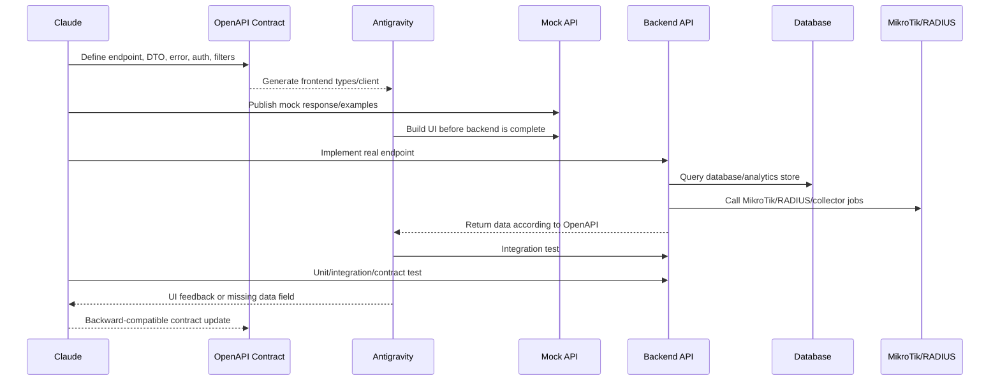

# Antigravity + Claude Implementation Flow

## 1. Mục tiêu

Tài liệu này quy định cách các coding agent phối hợp để hoàn thiện hệ thống MikroTik Centralized Fleet Management.

```text
Claude       = Backend, database, workers, MikroTik integration, HA, health, OpenAPI, Frontend (pages, components, UX)
Antigravity  = Có thể tiếp tục sửa frontend/, nhưng Claude là owner chính từ 2026-09-01
API Contract = OpenAPI là nguồn sự thật chung
```

> **Cập nhật 2026-09-01:** Claude đảm nhận luôn việc code giao diện (frontend), không chỉ backend/API như bản trước của tài liệu này. Trong phiên làm việc trước đó, Antigravity từng ghi đè `frontend/src/pages/Login.tsx` bằng một login giả bypass API thật — Claude đã sửa lại và giờ là bên chịu trách nhiệm chính cho `frontend/`. Nếu Antigravity vẫn sửa file trong `frontend/` song song, đối chiếu với bản Claude cập nhật gần nhất trước khi merge để tránh ghi đè lẫn nhau (xem thời gian sửa file, không giả định bản mới hơn luôn đúng).

Frontend không truy cập trực tiếp database, RADIUS, User Manager hoặc MikroTik. Frontend chỉ giao tiếp với Backend qua API.

---

## 2. Phân chia trách nhiệm

### Claude phụ trách Backend

- Backend REST API `/api/v1`.
- OpenAPI contract.
- Authentication và RBAC.
- Database schema và migrations.
- Inventory Area/Ship/Device/Interface.
- Service registry và dynamic endpoint.
- MikroTik API/REST API adapter.
- RADIUS/User Manager adapter.
- SNMP, IPFIX, DNS và Syslog collectors.
- Raw data storage.
- Identity correlation và traffic classification.
- WAN/CREW/BUSINESS reconciliation.
- Dashboard aggregation APIs.
- Background jobs.
- RADIUS/database failover.
- Backup, restore và health monitoring.
- Backend unit/integration/contract tests.

### Claude phụ trách Frontend (từ 2026-09-01 — trước đây do Antigravity đảm nhiệm)

- Login và session UI.
- Global/Area/Ship/Device dashboards.
- WAN, CREW, BUSINESS và reconciliation views.
- User/AAA screens.
- Traffic Flow screens.
- Server health screens.
- Endpoint management screens.
- Alert và audit screens.
- Chart, table, filter và drill-down.
- Loading, empty, stale-data và error states.
- Responsive layout và accessibility.
- Frontend unit/component/e2e tests.

### Hai bên cùng chịu trách nhiệm

- Review OpenAPI.
- Review request/response examples.
- Contract tests.
- End-to-end tests.
- Xác nhận timezone, units và semantics của các metric.
- Xác nhận acceptance criteria.

---

## 3. Contract-first workflow



### Trình tự bắt buộc cho mỗi feature

1. Claude viết use case và OpenAPI contract.
2. Claude tạo request/response examples và mock response.
3. Antigravity xây UI bằng mock API.
4. Claude implement database/service thật.
5. Claude implement endpoint và backend tests.
6. Antigravity nối UI vào endpoint thật.
7. Hai bên chạy contract test và end-to-end test.
8. Hai bên kiểm tra loading, empty, stale-data, error và permission state.
9. Chỉ merge khi UI và API cùng đạt Definition of Done.

OpenAPI trong `contracts/openapi.yaml` là nguồn sự thật duy nhất. Không được đoán API từ database schema hoặc từ code chưa public.

---

## 4. Cấu trúc repository

```text
project-root/
├── backend/                 # Claude owns
├── frontend/                # Antigravity owns
├── contracts/               # Shared API contract
│   ├── openapi.yaml
│   ├── events.yaml
│   └── examples/
├── infra/                   # Claude owns
├── docs/                    # Shared
├── SYSTEM_SPEC.md
└── AGENT_COLLABORATION.md
```

### Quy tắc ownership

| Thư mục | Agent chính | Quy tắc |
|---|---|---|
| `backend/` | Claude | Antigravity chỉ đọc contract và API docs |
| `frontend/` | Claude | Antigravity có thể vẫn đóng góp, nhưng Claude là owner chính, tự sửa UI trực tiếp |
| `contracts/` | Claude đề xuất, hai bên review | Breaking change phải có version/migration |
| `infra/` | Claude | Chứa database, collector, backup, health và deployment |
| `docs/` | Hai bên | Cập nhật khi behavior thay đổi |

### Branch/worktree

```text
main
├── backend/<feature-name>
├── frontend/<feature-name>
└── contract/<feature-name>
```

Mỗi feature cần một ID, ví dụ `SHIP-RECONCILIATION-001`, dùng trong branch, commit, test và audit.

---

## 5. API convention

### Base path

```text
/api/v1
```

### Response thành công

```json
{
  "data": {},
  "meta": {
    "request_id": "req_01H...",
    "generated_at": "2026-08-24T10:00:00Z",
    "data_from": "2026-08-24T09:00:00Z",
    "data_to": "2026-08-24T10:00:00Z",
    "data_freshness_seconds": 12
  },
  "error": null
}
```

### Response lỗi

```json
{
  "data": null,
  "meta": {
    "request_id": "req_01H..."
  },
  "error": {
    "code": "RADIUS_ENDPOINT_UNHEALTHY",
    "message": "No healthy RADIUS endpoint is available",
    "details": {
      "service_name": "radius.auth"
    }
  }
}
```

### Quy tắc API

- Timestamp dùng UTC ISO 8601.
- ID dùng UUID hoặc ID ổn định từ inventory.
- List endpoint phải hỗ trợ pagination, sort và filter.
- Dashboard endpoint phải hỗ trợ `from`, `to`, `timezone`, `area_id`, `ship_id`.
- Raw records chỉ trả qua endpoint có permission và pagination.
- Không trả secret, shared secret, password, private key hoặc credential cho Frontend.
- Mọi response phải có `request_id`.
- Frontend phải hiển thị `data_freshness_seconds`.
- Không coi dữ liệu cũ là dữ liệu live.

### Async jobs

Các thao tác push config, backup, restore, failover, rollout hoặc raw reprocessing phải trả job ngay.

```http
POST /api/v1/jobs/config-apply
```

```json
{
  "data": {
    "job_id": "job_01H...",
    "status": "queued",
    "poll_url": "/api/v1/jobs/job_01H..."
  },
  "meta": {
    "request_id": "req_01H..."
  },
  "error": null
}
```

Frontend dùng `poll_url` hoặc SSE event stream để hiển thị tiến độ.

---

## 6. API modules cần thống nhất

### Authentication

```text
POST /api/v1/auth/login
POST /api/v1/auth/refresh
POST /api/v1/auth/logout
GET  /api/v1/auth/me
GET  /api/v1/auth/permissions
```

### Global, area và ship

```text
GET /api/v1/dashboard/global
GET /api/v1/areas
GET /api/v1/areas/{areaId}/dashboard
GET /api/v1/ships
GET /api/v1/ships/{shipId}/dashboard
GET /api/v1/ships/{shipId}/topology
```

### Ship reconciliation

```text
GET /api/v1/ships/{shipId}/reconciliation
GET /api/v1/ships/{shipId}/reconciliation/by-wan
GET /api/v1/ships/{shipId}/reconciliation/by-interface
GET /api/v1/ships/{shipId}/reconciliation/by-zone
GET /api/v1/ships/{shipId}/reconciliation/raw-records
```

Query parameters:

```text
from
to
timezone
granularity=1m|5m|1h|1d
zone=CREW|BUSINESS|MANAGEMENT|ALL
```

### CREW User/AAA

```text
GET /api/v1/ships/{shipId}/crew/users
GET /api/v1/ships/{shipId}/crew/users/{userId}
GET /api/v1/ships/{shipId}/crew/users/{userId}/sessions
GET /api/v1/ships/{shipId}/crew/users/{userId}/usage
GET /api/v1/ships/{shipId}/crew/users/{userId}/services
GET /api/v1/ships/{shipId}/crew/users/{userId}/raw-records
GET /api/v1/ships/{shipId}/crew/radius-health
```

### BUSINESS

```text
GET /api/v1/ships/{shipId}/business/ports
GET /api/v1/ships/{shipId}/business/vlans
GET /api/v1/ships/{shipId}/business/devices
GET /api/v1/ships/{shipId}/business/usage
GET /api/v1/ships/{shipId}/business/flows
```

### Device và interface

```text
GET /api/v1/devices/{deviceId}
GET /api/v1/devices/{deviceId}/health
GET /api/v1/devices/{deviceId}/interfaces
GET /api/v1/devices/{deviceId}/interfaces/{interfaceId}/traffic
GET /api/v1/devices/{deviceId}/config-revisions
GET /api/v1/devices/{deviceId}/logs
```

### Server health và dynamic endpoints

```text
GET  /api/v1/health/summary
GET  /api/v1/health/services
GET  /api/v1/health/services/{serviceName}
GET  /api/v1/service-endpoints
POST /api/v1/service-endpoints/{id}/check
POST /api/v1/service-endpoints/{id}/enable
POST /api/v1/service-endpoints/{id}/disable
POST /api/v1/service-endpoints/{id}/rollout
POST /api/v1/service-endpoints/{id}/rollback
```

### Jobs, alerts và audit

```text
GET  /api/v1/jobs/{jobId}
POST /api/v1/jobs/{jobId}/cancel
POST /api/v1/jobs/{jobId}/rollback
GET  /api/v1/alerts
POST /api/v1/alerts/{alertId}/ack
POST /api/v1/alerts/{alertId}/resolve
GET  /api/v1/audit-logs
GET  /api/v1/events/stream
```

`/api/v1/events/stream` dùng SSE cho alert, health transition, job progress và endpoint failover. Frontend phải có polling fallback nếu SSE bị gián đoạn.

---

## 7. Feature flow

### 7.1. Global dashboard

```text
Antigravity:
  GlobalDashboardPage
  → GET /api/v1/dashboard/global
  → render KPI, chart, alert table
  → click Area để chuyển xuống Area Dashboard

Claude:
  nhận time/filter
  → đọc aggregate tables
  → kiểm tra freshness
  → trả data + meta + warning nếu có
```

### 7.2. Ship reconciliation

```text
Antigravity:
  chọn Ship + thời gian
  → GET /ships/{id}/reconciliation
  → render WAN, CREW, BUSINESS, gap, waterfall
  → click gap để gọi raw-records

Claude:
  đọc interface counter snapshots
  → tính delta và detect counter reset
  → đọc RADIUS usage
  → đọc zone usage
  → tính reconciliation
  → trả gap_reason và data_quality
```

### 7.3. CREW user detail

```text
Antigravity:
  chọn user
  → GET user summary
  → GET usage chart
  → GET services
  → GET sessions
  → GET raw-records khi drill-down

Claude:
  join username + IP + MAC + session time
  → join IPFIX + DNS + RADIUS accounting
  → classify service
  → trả usage theo category/domain
```

### 7.4. Thay đổi địa chỉ server

```text
Antigravity:
  mở ServiceEndpointPage
  → nhập host/port/protocol
  → gọi validate/check
  → hiển thị health result
  → chọn scope rollout
  → theo dõi job progress

Claude:
  validate DNS/IP/port/certificate
  → synthetic health check
  → tạo staged config
  → rollout theo area/ship batch
  → verify auth/accounting/telemetry
  → commit hoặc rollback
```

### 7.5. Server failover

```text
Health monitor phát hiện RADIUS-01 hoặc DB-01 unhealthy
→ tạo alert
→ đánh dấu endpoint unhealthy
→ chọn endpoint ưu tiên tiếp theo
→ cập nhật routing/service discovery
→ kiểm tra synthetic request
→ cập nhật dashboard
→ ghi audit và incident timeline
```

Frontend chỉ hiển thị và tạo lệnh failover có quyền; quyết định retry, circuit breaker, endpoint selection và rollback thuộc Backend.

---

## 8. Dynamic endpoint và health contract

### Service registry

```text
service_name
service_type
host
port
protocol
priority
enabled
scope
healthcheck_type
healthcheck_interval
timeout_ms
last_status
last_check_at
last_success_at
failure_count
config_version
```

Service name mẫu:

```text
radius.auth
radius.accounting
database.control
database.analytics
collector.ipfix
collector.syslog
storage.raw
```

### Trạng thái

```text
HEALTHY
DEGRADED
UNHEALTHY
UNKNOWN
MAINTENANCE
```

### Health check phải kiểm tra chức năng

| Service | Check |
|---|---|
| RADIUS | Synthetic Access-Request, RTT, timeout, accept/reject |
| RADIUS accounting | Accounting packet gần nhất hoặc test accounting |
| User Manager | API/REST query, database size, free disk |
| Database | Connection, read, write transaction, replication lag |
| IPFIX | Last flow received, queue depth |
| SNMP | Last poll, timeout/error rate |
| Syslog | Last event, ingest rate |
| Raw storage | Write/read test, free space |
| Backup | Last backup, checksum, restore test result |
| Controller | API, worker, job queue |

Health check không được chỉ kiểm tra TCP port.

---

## 9. Quy trình phát triển

> Từ 2026-09-01, các mục "Antigravity:" trong sprint breakdown dưới đây do Claude thực hiện (xem mục 1 và mục 2), trừ khi được ghi chú khác trong hội thoại.

### Sprint 0 — Contract và skeleton

Claude:

- Tạo OpenAPI skeleton.
- Tạo response envelope/error schema.
- Tạo auth/RBAC model.
- Tạo mock response.
- Tạo local development stack.

Antigravity:

- Tạo app shell.
- Tạo routing.
- Tạo auth guard.
- Tạo API client từ OpenAPI.
- Tạo loading/error/empty state.

### Sprint 1 — Inventory

Claude:

- Area/Ship/Device/Interface APIs.
- Database migration.
- Health model.

Antigravity:

- Inventory pages.
- Area/Ship/Device detail.
- Health status components.

### Sprint 2 — Ship dashboard

Claude:

- Dashboard aggregate APIs.
- Interface counter ingestion.
- WAN/ether reconciliation.

Antigravity:

- Ship dashboard.
- WAN charts.
- Ether tables.
- Reconciliation waterfall.

### Sprint 3 — CREW AAA

Claude:

- RADIUS/User Manager adapter.
- Session/accounting ingestion.
- User usage aggregation.

Antigravity:

- Crew user list.
- User detail.
- Session history.
- Service usage chart.

### Sprint 4 — BUSINESS và Flow

Claude:

- Business port/VLAN ingestion.
- IPFIX/DNS raw ingest.
- Flow classification.

Antigravity:

- Business dashboard.
- Traffic Flow dashboard.
- Raw flow drill-down.

### Sprint 5 — HA và operations

Claude:

- Multi-RADIUS.
- Database failover.
- Dynamic endpoint registry.
- Backup/restore.
- Server health.

Antigravity:

- Server health dashboard.
- Endpoint management page.
- Rollout/failover progress.
- Incident and audit pages.

---

## 10. Definition of Done

### Backend DoD

- Endpoint có trong OpenAPI.
- Request/response schema rõ ràng.
- Permission được kiểm tra.
- Database migration hoàn chỉnh.
- Unit test.
- Integration test.
- Contract test.
- Health/error handling.
- Audit log cho thao tác thay đổi.
- Mock examples cho Frontend.

### Frontend DoD

- Page/route hoàn chỉnh.
- API client generated từ OpenAPI.
- Loading state.
- Empty state.
- Error state.
- Stale-data state.
- Filter/time range.
- Permission-based rendering.
- Responsive layout.
- Drill-down.
- Component/e2e test.

### Shared DoD

- OpenAPI không lệch implementation.
- Generated client đã cập nhật.
- E2E test chạy được.
- UI đối chiếu được với raw record.
- Có test mất RADIUS/database/collector.
- Không có secret trong frontend bundle.

---

## 11. Quy tắc thay đổi API

### Non-breaking change

```text
Claude cập nhật OpenAPI
→ Backend thêm field nullable
→ Antigravity update generated types
→ UI sử dụng field mới nếu có
→ Client cũ vẫn hoạt động
```

### Breaking change

```text
Không sửa phá vỡ /api/v1.
Tạo /api/v2 hoặc migration plan.
Giữ v1 trong thời gian deprecation.
Chạy song song v1/v2 contract test.
```

### Không được làm

- Frontend tự đoán tên field.
- Backend đổi field nhưng không sửa OpenAPI.
- Frontend gọi endpoint chưa có contract.
- Frontend gọi thẳng database, MikroTik hoặc RADIUS.
- Trả database exception trực tiếp ra browser.
- Trả password, shared secret hoặc private key.
- Đưa logic failover vào Frontend.

---

## 12. Prompt giao việc cho Claude

```text
Bạn là Backend/Platform + Frontend agent (từ 2026-09-01, đảm nhận cả hai).

Đọc SYSTEM_SPEC.md và AGENT_COLLABORATION.md trước khi code.
Sửa backend, frontend, contracts, infra và docs liên quan.
Trước khi sửa file trong frontend/, kiểm tra thời gian sửa gần nhất — nếu Antigravity
vừa sửa song song, đối chiếu thay đổi của họ trước khi ghi đè, đừng giả định bản của
mình luôn đúng hơn.

Với mỗi feature:
1. Tạo hoặc cập nhật OpenAPI trước.
2. Nêu rõ database migration.
3. Tạo mock/example response nếu backend chưa xong khi bắt đầu xây UI.
4. Implement endpoint/service/worker.
5. Implement UI: loading, empty, error và stale-data states; hiển thị data freshness
   và permission state; filter, time range, drill-down theo đặc tả.
6. Viết unit, integration, contract và component/e2e tests.
7. Ghi rõ endpoint, permission, freshness và error codes.
8. Không hard-code server address hoặc secret; không hard-code dữ liệu giả trong UI.
9. Nếu thay đổi API, phải nêu breaking/non-breaking.
10. Báo rõ cách chạy test và cách rollback.
```

## 13. Prompt giao việc cho Antigravity (vai trò phụ, không còn là owner chính của frontend/)

```text
Bạn là Frontend agent.

Đọc SYSTEM_SPEC.md và AGENT_COLLABORATION.md trước khi code.
Claude là owner chính của frontend/ từ 2026-09-01; nếu sửa file trong frontend/,
kiểm tra thay đổi gần nhất của Claude trước để tránh ghi đè logic đã nối API thật.
Không truy cập trực tiếp database, MikroTik hoặc RADIUS.

Với mỗi feature:
1. Đọc OpenAPI contract.
2. Dùng generated API client/types.
3. Nếu backend chưa hoàn tất, dùng mock response.
4. Implement loading, empty, error và stale-data states.
5. Hiển thị data freshness và permission state.
6. Có filter, time range và drill-down theo đặc tả.
7. Viết component/e2e tests.
8. Không tự ý đổi API contract.
9. Nếu thiếu field, tạo feedback contract rõ ràng cho Claude.
```
