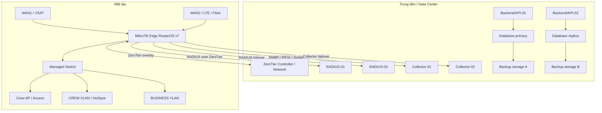

# Hardware + ZeroTier + RADIUS Commissioning Flow

## 1. Mục tiêu

Tài liệu này quy định cách thiết kế phần cứng, kết nối các MikroTik trên từng tàu với hệ thống trung tâm bằng ZeroTier, sau đó cấu hình HotSpot/RADIUS cho mạng CREW.

```text
Tàu → MikroTik Edge → ZeroTier private network → Controller / RADIUS / Backend
```

Mục tiêu của ZeroTier trong thiết kế này là tạo một mạng quản trị/AAA overlay. Không sử dụng ZeroTier để đưa toàn bộ lưu lượng Internet của tàu về trung tâm trừ khi có yêu cầu riêng.

---

## 2. Kiến trúc phần cứng tham chiếu



---

## 3. Phân lớp phần cứng

### 3.1. Trung tâm

| Thành phần | Tối thiểu | Khuyến nghị |
|---|---:|---:|
| ZeroTier network/controller | 1 | Private network, backup controller config |
| Backend/API | 1 | 2 node sau load balancer |
| RADIUS | 2 | 3 node hoặc 2 node + standby |
| Database | 2 | 3 node database cluster |
| Collector | 1 | 2 node hoặc có local queue/buffer |
| Raw storage | 2 target | 2 storage độc lập + offsite |
| Monitoring | 1 | Monitoring độc lập với app server |

Không giả định User Manager tự đồng bộ active-active giữa nhiều RouterOS. Nếu dùng User Manager, chọn primary/standby với backup `.umb`; nếu yêu cầu HA realtime, dùng RADIUS backend có database replication và giữ User Manager như adapter/phạm vi phụ.

### 3.2. Mỗi tàu

| Thành phần | Vai trò |
|---|---|
| Edge MikroTik | WAN, firewall, routing, NAT, HotSpot, RADIUS client, ZeroTier |
| Managed switch | VLAN, CREW/BUSINESS port assignment, port counter |
| Access Point | SSID/CREW access, bridge vào CREW VLAN |
| Optional secondary edge | Dự phòng WAN/router nếu yêu cầu HA tại tàu |
| Local management access | Cổng hoặc VLAN cứu hộ khi ZeroTier chưa hoạt động |

### 3.3. Thông tin cần thu thập trước khi chọn thiết bị

```text
model
architecture
RouterOS version
RAM
storage/free disk
license level
number of WAN ports
number of CREW ports
number of BUSINESS ports
number of VLANs
expected concurrent HotSpot users
expected bandwidth
expected IPFIX flow rate
PoE requirement
SFP requirement
temperature/power constraints
```

ZeroTier trên RouterOS phải được kiểm tra theo architecture, RouterOS version và device-mode. Tài liệu RouterOS hiện ghi ZeroTier hỗ trợ trên ARM/ARM64 trong RouterOS v7 và feature này có thể bị tắt bởi device-mode. [ZeroTier trên RouterOS](https://manual.mikrotik.com/docs/tags/zerotier/), [ZeroTier interface](https://manual.mikrotik.com/docs/cli-reference/zerotier/interface/), [Device mode](https://manual.mikrotik.com/docs/system-information-and-utilities/device-mode/)

---

## 4. Thiết kế ZeroTier

### 4.1. Private network

Tạo một ZeroTier private network riêng cho hệ thống quản trị:

```text
Network name: mikrotik-management
Network ID:   <16-digit-network-id>
Overlay CIDR: 10.250.0.0/16
```

ZeroTier network phải bật authorization cho member. Chỉ các node đã được phê duyệt mới được tham gia.

### 4.2. Quy hoạch địa chỉ

Ví dụ quy hoạch, cần thay đổi theo hệ thống thực tế:

```text
10.250.0.0/24    Infrastructure
10.250.1.0/24    Area-A routers
10.250.2.0/24    Area-B routers
10.250.10.0/24   RADIUS services
10.250.20.0/24   Backend/API
10.250.30.0/24   Collectors
10.250.40.0/24   Break-glass / temporary devices
```

Mỗi router nên có một ZeroTier IP ổn định được lưu trong inventory:

```text
ship_id
device_id
zerotier_node_id
zerotier_ip
network_id
authorized_at
last_seen
```

### 4.3. RouterOS ZeroTier policy

Thiết kế mặc định:

```text
allow-managed = yes
allow-global  = no
allow-default = no
bridge        = no
```

Ý nghĩa:

- `allow-managed=yes`: nhận IP/route do ZeroTier controller quản lý.
- `allow-default=no`: không biến ZeroTier thành default route của toàn bộ tàu.
- `allow-global=no`: không cho phép overlap public IP nếu không cần.
- Không bridge ZeroTier vào CREW/BUSINESS; dùng L3 management/AAA overlay.

### 4.4. Managed routes

Chỉ tạo route cần thiết:

```text
ZeroTier network → 10.250.0.0/16
RADIUS service    → 10.250.10.0/24
Backend/API       → 10.250.20.0/24
Collector         → 10.250.30.0/24
```

Không route toàn bộ Internet của tàu qua ZeroTier nếu không có yêu cầu rõ ràng. ZeroTier controller cần cấu hình managed route và IP auto-assignment để các node giao tiếp. [ZeroTier Network Controller](https://docs.zerotier.com/controller/)

---

## 5. Flow triển khai phần cứng và ZeroTier

```mermaid
flowchart LR
    A["Inventory phần cứng"] --> B["Kiểm tra RouterOS / architecture"]
    B --> C["Thiết kế port/VLAN/WAN"]
    C --> D["Backup cấu hình hiện tại"]
    D --> E["Bật ZeroTier feature nếu cần"]
    E --> F["Join private ZeroTier network"]
    F --> G["Authorize node"]
    G --> H["Gán ZeroTier IP/managed route"]
    H --> I["Firewall chỉ cho management/AAA"]
    I --> J["Kiểm tra Backend/RADIUS/Collector"]
    J --> K["Cấu hình HotSpot + RADIUS"]
    K --> L["Bật accounting/interim"]
    L --> M["Test user CREW"]
    M --> N["Bật IPFIX/SNMP/Syslog"]
    N --> O["Health check + dashboard"]

    B --> X["Không tương thích"]
    X --> Y["Đổi thiết bị hoặc dùng fallback VPN"]
    J --> R["Kiểm tra thất bại"]
    R --> S["Rollback / sửa route/firewall"]
    S --> J
```



---

## 6. Flow phối hợp cấu hình với ChatGPT

Mỗi tàu phải được cấu hình theo từng checkpoint. Không gửi secret hoặc private key vào chat.

### Bước 1 — Gửi thông tin thiết bị

Người vận hành gửi:

```text
Ship ID:
Area:
Device ID:
Model:
RouterOS version:
Architecture:
WAN interfaces:
CREW interfaces/VLAN:
BUSINESS interfaces/VLAN:
Local management IP:
Current configuration status:
Maintenance window:
```

### Bước 2 — Chạy discovery read-only

ChatGPT sẽ đưa nhóm lệnh chỉ đọc phù hợp với RouterOS version. Người vận hành gửi output đã che thông tin nhạy cảm.

Thông tin cần kiểm tra:

```text
system resource
system package
system device-mode
zerotier status/config
zerotier interface
ip address
ip route
ip firewall filter
radius
hotspot profile
interface stats
```

Không được thực hiện bước ghi cấu hình nếu chưa có:

- RouterOS version.
- Architecture.
- Backup thành công.
- Local recovery path.
- ZeroTier network ID.
- ZeroTier IP allocation.
- RADIUS endpoint list.
- CREW/BUSINESS interface mapping.

### Bước 3 — Backup trước thay đổi

Tạo:

```text
binary encrypted backup
text export
current package/version snapshot
current interface/address/route snapshot
```

Backup phải được tải về ít nhất hai storage target. User Manager database phải backup riêng nếu có chạy trên router.

### Bước 4 — Thiết lập ZeroTier

Theo thứ tự:

```text
1. Kiểm tra package/device-mode.
2. Tạo hoặc enable ZeroTier instance.
3. Join private network.
4. Lấy node ID.
5. Authorize node trên controller.
6. Gán managed ZeroTier IP.
7. Xác nhận interface running.
8. Xác nhận route tới RADIUS/API/collector.
9. Ping và kiểm tra TCP service qua ZeroTier.
```

### Bước 5 — Cấu hình firewall management

Chỉ cho phép qua ZeroTier từ các nguồn cần thiết:

```text
Controller → RouterOS API/REST/SSH
Router → RADIUS authentication/accounting
Router → Collector SNMP/IPFIX/Syslog
Monitoring → Router health probes
```

Không mở RouterOS management service trên WAN public nếu không bắt buộc.

### Bước 6 — Kết nối RADIUS

Trên RouterOS:

```text
RADIUS-01 = ZeroTier IP, priority 10
RADIUS-02 = ZeroTier IP, priority 20
RADIUS-03 = ZeroTier IP, priority 30 nếu có
```

Tùy backend, dùng UDP trong ZeroTier hoặc RadSec. Nếu dùng RadSec, cần quản lý certificate, CN/SAN và trust chain.

Trên RADIUS/User Manager:

```text
NAS name      = ship/device identity
NAS address   = ZeroTier IP của MikroTik
service       = hotspot
shared secret = lưu trong secret manager, không ghi plain text
```

### Bước 7 — Bật CREW HotSpot/RADIUS

Chỉ sau khi RADIUS test thành công:

```text
1. Gắn HotSpot vào CREW VLAN/interface.
2. Enable RADIUS authentication.
3. Enable accounting.
4. Enable interim update.
5. Kiểm tra Access-Accept.
6. Kiểm tra session Start/Interim/Stop.
7. Kiểm tra quota/profile/rate-limit.
8. Kiểm tra CoA/Disconnect nếu dùng.
```

### Bước 8 — Bật telemetry

```text
SNMP  → Collector-01/Collector-02
IPFIX → Flow collector
Syslog → Log collector
DNS   → DNS/raw event collector nếu được phép
```

### Bước 9 — Xác nhận cuối

```text
ZeroTier connected
RADIUS-01 healthy
RADIUS-02 healthy hoặc standby reachable
HotSpot login thành công
Accounting có dữ liệu
CREW usage hiển thị
BUSINESS port counters hiển thị
IPFIX có raw flow
SNMP có interface counters
Syslog có event
Dashboard ship không stale
```

---

## 7. Kiểm thử failover

### ZeroTier

- Tắt đường WAN chính.
- Kiểm tra ZeroTier giữ hoặc khôi phục peer qua WAN dự phòng.
- Kiểm tra route tới RADIUS.
- Kiểm tra last seen trên dashboard.

### RADIUS

- Làm RADIUS-01 unhealthy trong lab.
- Đăng nhập một CREW user mới.
- Xác nhận request đi tới RADIUS-02.
- Xác nhận accounting vẫn được ghi.
- Khôi phục RADIUS-01.
- Xác nhận priority trở lại đúng.

### Database

- Đưa primary vào trạng thái unhealthy trong lab.
- Kiểm tra Backend chuyển sang standby/replica.
- Kiểm tra dashboard không mất dữ liệu đã commit.
- Kiểm tra replication lag và incident log.

### Collector

- Dừng Collector-01.
- Kiểm tra Collector-02 hoặc local buffer.
- Xác nhận không mất raw data ngoài RPO.

---

## 8. Rollback

Rollback khi xảy ra một trong các điều kiện:

- Mất local management path.
- Không join được ZeroTier.
- Không route được tới RADIUS.
- RADIUS authentication fail.
- HotSpot làm gián đoạn BUSINESS.
- Interface/VLAN mapping sai.
- CPU/RAM tăng bất thường.
- Dashboard reconciliation sai vượt ngưỡng.

Thứ tự rollback:

```text
1. Giữ local access.
2. Disable thay đổi mới nhất.
3. Restore address/route/firewall snapshot.
4. Restore binary backup nếu cần.
5. Kiểm tra WAN và local LAN.
6. Ghi audit và nguyên nhân.
7. Chỉ thử lại sau khi cập nhật design.
```

---

## 9. Hardware commissioning record

Mỗi thiết bị phải có một record:

```text
area_id
ship_id
device_id
model
serial
architecture
routeros_version
device_mode
zerotier_network_id
zerotier_node_id
zerotier_ip
wan_interfaces
crew_interfaces
business_interfaces
management_interface
radius_endpoint_ids
collector_endpoint_ids
last_backup_at
last_health_check_at
commissioned_by
commissioned_at
rollback_revision
```

---

## 10. Quy tắc an toàn

- ZeroTier network phải là private network.
- Chỉ authorize node hợp lệ.
- Không bridge ZeroTier với CREW/BUSINESS.
- Không bật `allow-default` nếu không có thiết kế full-tunnel.
- Không mở WinBox/API/REST/SSH trên WAN public nếu không cần.
- Không gửi RADIUS secret, certificate private key hoặc ZeroTier identity vào chat.
- Không cấu hình hàng loạt trước khi test một tàu mẫu.
- Luôn giữ local recovery path.
- Luôn backup trước và sau thay đổi lớn.
- Tách management, CREW và BUSINESS bằng VLAN/firewall.
- Kiểm tra RouterOS device-mode trước khi bật ZeroTier.
