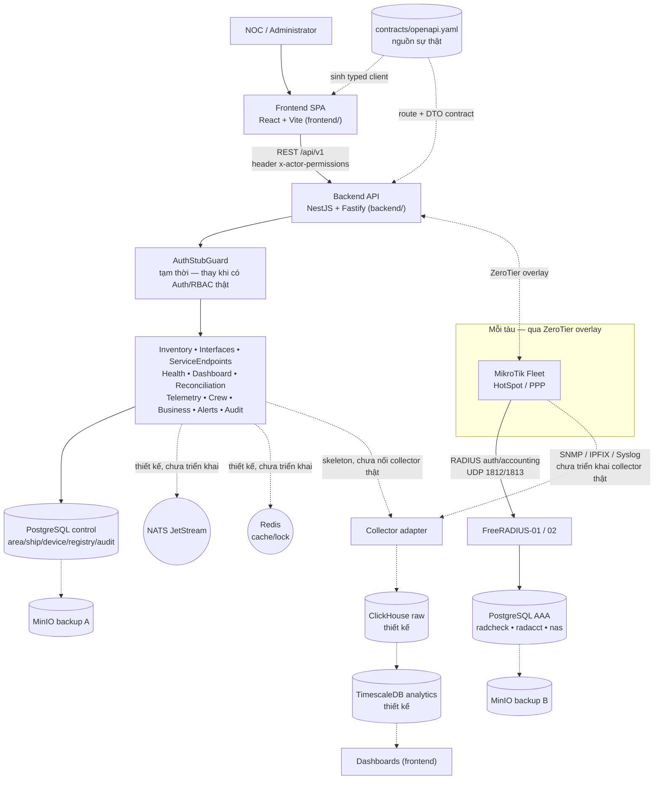
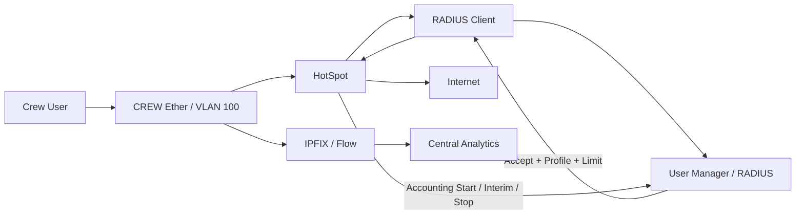
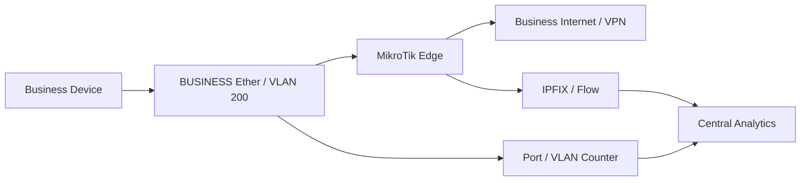
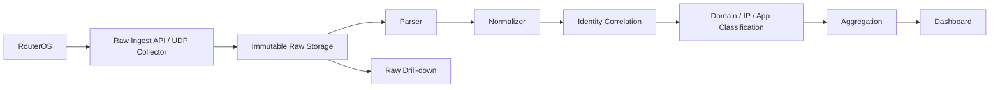
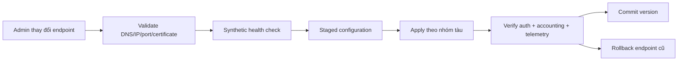

# MikroTik Centralized Fleet Management System

## System Specification v0.1

> Tài liệu này là source of truth để Claude sử dụng khi thiết kế và lập trình hệ thống.
> Không triển khai trực tiếp lên thiết bị thật nếu chưa có inventory, backup và môi trường lab.

---

## 1. Mục tiêu

Xây dựng nền tảng quản lý tập trung nhiều thiết bị MikroTik theo cấu trúc:

```text
Tổ chức
└── Khu vực
    └── Tàu
        ├── WAN / Edge Router
        ├── Core / Distribution
        ├── Switch
        ├── Access Point
        └── CPE / thiết bị mạng khác
```

Hệ thống phải thực hiện được:

1. Quản lý inventory theo khu vực, tàu và thiết bị.
2. Quản lý tập trung cấu hình RouterOS qua API/REST API.
3. Quản lý mạng CREW và BUSINESS tách biệt.
4. CREW sử dụng HotSpot + RADIUS + User Manager.
5. Thu thập dữ liệu thô từ tàu về server trung tâm.
6. Phân tích user đã dùng bao nhiêu và truy cập nhóm dịch vụ nào.
7. Đối soát dữ liệu WAN, ether/VLAN, CREW, BUSINESS và user usage.
8. Có dashboard theo hệ thống, khu vực, tàu, thiết bị, WAN, flow và user.
9. Có tối thiểu hai hệ thống RADIUS và tối thiểu hai hệ thống lưu trữ/backup độc lập.
10. Không hard-code địa chỉ server; cho phép thay đổi endpoint mà không cần sửa code.
11. Theo dõi health của server, database, collector, RADIUS và thiết bị MikroTik.
12. Có audit log, backup, restore và khả năng rollback cấu hình.

---

## 2. Nguyên tắc kiến trúc

### 2.1. Tách AAA khỏi Fleet Management

User Manager được dùng cho AAA, gồm authentication, authorization, profiles, limitations, session và accounting. User Manager không thay thế Controller quản lý cấu hình fleet.

Fleet Controller phải là service riêng, dùng API/REST API để đọc và thay đổi cấu hình RouterOS.

### 2.2. Tách dữ liệu raw và dữ liệu đã phân tích

Mọi dữ liệu thô nhận từ thiết bị phải được lưu trước khi normalize hoặc aggregate.

```text
Raw ingest → Raw immutable storage → Normalize → Correlate identity → Classify → Aggregate → Dashboard
```

Không được chỉ lưu kết quả tổng hợp mà xóa dữ liệu raw, vì cần raw data để điều tra sai lệch.

### 2.3. Tách dữ liệu CREW và BUSINESS

```text
CREW:
  HotSpot → RADIUS/User Manager → username/session/accounting

BUSINESS:
  Ether/VLAN → port/IP/MAC/device accounting
  Không có username nếu chưa triển khai cơ chế xác thực bổ sung
```

### 2.4. Không hard-code địa chỉ

Địa chỉ của RADIUS, database, collector, controller và storage phải được lưu trong service registry/configuration service.

Ứng dụng chỉ sử dụng logical service name, ví dụ:

```text
radius.auth
radius.accounting
database.control
database.analytics
collector.ipfix
collector.syslog
storage.raw
```

Mỗi logical service có thể có nhiều endpoint và thứ tự ưu tiên.

---

## 3. Kiến trúc tổng thể



Đường nét liền = đã chạy được (đã verify: frontend gọi được backend qua proxy dev + CORS, `AuthStubGuard` chặn đúng theo `x-actor-permissions`, FreeRADIUS/PostgreSQL AAA có ghi chú triển khai riêng ở `RADIUS_POSTGRESQL_PROJECT_NOTE.md`). Đường nét đứt = có trong thiết kế hạ tầng (`docs/INFRASTRUCTURE_INVENTORY.md`) nhưng chưa triển khai/nối thật — Collector adapter mới là skeleton, chưa có collector RouterOS/SNMP/IPFIX thật, NATS/Redis/ClickHouse/TimescaleDB chưa chạy trong `infra/docker-compose.core.yml` ở môi trường hiện tại.

MikroTik RouterOS có RADIUS client cho HotSpot và các dịch vụ khác; danh sách RADIUS có thứ tự ưu tiên, hỗ trợ backup server và UDP/RadSec. [RouterOS RADIUS](https://manual.mikrotik.com/docs/authentication-authorization-accounting/radius/)

---

## 4. Mô hình mạng trên mỗi tàu

### 4.1. Các vùng mạng

```text
VLAN 10   MANAGEMENT
VLAN 100  CREW
VLAN 200  BUSINESS
```

### 4.2. CREW



CREW phải bật:

- HotSpot authentication.
- RADIUS authentication.
- RADIUS accounting.
- Interim update.
- Profile/limitation nếu cần quota.
- CoA/Disconnect nếu cần thay đổi rate-limit hoặc ngắt session.

### 4.3. BUSINESS



BUSINESS mặc định đo theo:

- Ether port.
- VLAN.
- IP.
- MAC.
- Device.
- Destination/domain/category.

Nếu BUSINESS cần đo theo người dùng, phải bổ sung 802.1X/RADIUS, PPPoE/RADIUS, HotSpot riêng hoặc một cơ chế identity binding khác.

---

## 5. Thu thập dữ liệu raw

### 5.1. Nguồn dữ liệu

| Nguồn | Dữ liệu | Mục đích |
|---|---|---|
| RADIUS accounting | username, session, IP, NAS, upload, download, uptime | CREW user usage |
| User Manager | users, profiles, limitations, sessions | AAA và quota |
| Interface counters | rx-byte, tx-byte, packets, drops, errors | WAN/ether reconciliation |
| IPFIX/Traffic Flow | source/destination, ports, protocol, bytes, packets, interface | Phân tích traffic |
| DHCP/HotSpot | IP, MAC, lease, username, thời gian | Identity correlation |
| DNS | client IP, query, domain, response | Domain classification |
| Syslog | auth, DHCP, DNS, firewall, link, system | Event và điều tra |

### 5.2. Pipeline



### 5.3. Identity correlation

Đối với CREW, join dữ liệu bằng:

```text
area_id
ship_id
nas_ip
username
acct_session_id
client_ip
client_mac
valid_from
valid_to
```

Đối với BUSINESS, join bằng:

```text
area_id
ship_id
device_id
interface_id
vlan_id
client_ip
client_mac
valid_from
valid_to
```

### 5.4. Không cam kết nhận diện nội dung HTTPS

Hệ thống chỉ nên phân loại dựa trên:

- DNS domain.
- Destination IP.
- Port/protocol.
- IP/ASN catalog.
- TLS metadata nếu có.

Phải lưu:

```text
classification_method
classification_confidence
unknown_reason
```

---

## 6. Đối soát dữ liệu trên từng tàu

### 6.1. Interface groups

Mỗi tàu phải có nhóm interface:

```text
WAN_INPUT       = WAN1, WAN2, VSAT, LTE
CREW_ACCESS     = các ether/VLAN CREW
BUSINESS_ACCESS = các ether/VLAN BUSINESS
MANAGEMENT      = management/VPN/loopback
```

Không được cộng đồng thời bridge, VLAN và port thành viên nếu chúng đo cùng một luồng dữ liệu.

### 6.2. Công thức

```text
WAN_RX = Σ delta(rx_byte của WAN_INPUT)
WAN_TX = Σ delta(tx_byte của WAN_INPUT)

CREW_PORT_DL = Σ delta(tx_byte của CREW_ACCESS)
CREW_PORT_UL = Σ delta(rx_byte của CREW_ACCESS)

BUSINESS_PORT_DL = Σ delta(tx_byte của BUSINESS_ACCESS)
BUSINESS_PORT_UL = Σ delta(rx_byte của BUSINESS_ACCESS)

CREW_USER_DL = Σ RADIUS download
CREW_USER_UL = Σ RADIUS upload
CREW_USER_TOTAL = CREW_USER_DL + CREW_USER_UL
```

### 6.3. Chênh lệch

```text
CREW_DOWNLOAD_GAP = CREW_PORT_DL - CREW_USER_DL
CREW_UPLOAD_GAP   = CREW_PORT_UL - CREW_USER_UL

WAN_DOWNLOAD_GAP = WAN_RX - CREW_PORT_DL - BUSINESS_PORT_DL
WAN_UPLOAD_GAP   = WAN_TX - CREW_PORT_UL - BUSINESS_PORT_UL
```

Chênh lệch phải được phân loại, không mặc định là lỗi:

- Management/VPN.
- Router-originated.
- Broadcast/multicast.
- Business traffic chưa có user.
- Thiết bị chưa login HotSpot.
- Flow chưa phân loại.
- NAT hoặc asymmetric routing.
- Counter reset.
- Flow bị mất hoặc bị sampling.
- FastTrack bypass Traffic Flow.

### 6.4. Dashboard `Ship Data Reconciliation`

KPI:

```text
WAN Download / Upload
CREW Download / Upload
CREW User Usage
CREW Gap / Gap %
BUSINESS Download / Upload
Unknown/System Traffic
Data Freshness
```

Bảng chính:

| Zone | Download | Upload | Đã định danh | Chưa định danh | Gap % |
|---|---:|---:|---:|---:|---:|
| CREW | | | User Manager | | |
| BUSINESS | | Port/IP/MAC | | | |
| MANAGEMENT | | | Không tính user | | |
| WAN tổng | | | | | |

---

## 7. Dashboard yêu cầu

### 7.1. Global Dashboard

- Tổng khu vực, tàu, thiết bị.
- Online/offline/degraded.
- Tổng WAN throughput.
- Active CREW users.
- RADIUS accept/reject.
- Active alerts.
- Collector/database health.
- Top tàu theo lưu lượng.
- Top tàu theo cảnh báo.
- Data freshness.

### 7.2. Area Dashboard

- So sánh các tàu trong khu vực.
- Tổng bandwidth theo tàu.
- Tàu offline.
- Tàu có packet loss/latency cao.
- CREW usage theo tàu.
- BUSINESS usage theo tàu.
- Cảnh báo theo loại.

### 7.3. Ship Dashboard

- Trạng thái tàu và Management VPN.
- Topology edge/core/access.
- WAN1/WAN2/VSAT/LTE.
- CPU/RAM/disk thiết bị.
- Active CREW users.
- Tổng CREW usage.
- Tổng BUSINESS usage.
- Ship Data Reconciliation.
- Top user/category/domain.
- Cảnh báo tàu.

### 7.4. Device Dashboard

- Model, serial, RouterOS version, uptime.
- CPU từng core, RAM, disk, temperature.
- Interface RX/TX/errors/drops.
- Link up/down.
- Routing neighbor.
- VPN handshake.
- Firewall drops.
- Queue usage.
- Config revision và config diff.

### 7.5. WAN/Link Dashboard

- RX/TX hiện tại và lịch sử.
- Capacity và utilization.
- Peak và 95th percentile.
- Latency, packet loss, jitter.
- Failover count.
- Downtime.
- Top user/category theo WAN.
- WAN saturation alerts.

### 7.6. Traffic Flow Dashboard

- Top user.
- Top source/destination.
- Top domain.
- Top category.
- Top port/protocol.
- Traffic theo WAN.
- Traffic theo CREW/BUSINESS.
- Unknown/encrypted traffic.
- Raw flow drill-down.

### 7.7. CREW User/AAA Dashboard

- Active HotSpot sessions.
- Authentication accepts/rejects/timeouts.
- Download/upload/total theo user.
- Quota consumption.
- Session history.
- Top service/category/domain.
- User IP/MAC/tàu.
- User chưa gửi accounting.
- User vượt hoặc gần quota.

### 7.8. Event/Audit Dashboard

- Device down.
- WAN down.
- VPN down.
- RADIUS failure.
- Database failure.
- Collector delayed.
- Gap vượt ngưỡng.
- User abnormal usage.
- Config changes.
- Before/after config diff.
- Người thao tác, thời gian, job ID, kết quả, rollback.

---

## 8. High Availability và backup

### 8.1. Nguyên tắc bắt buộc

Không triển khai một RADIUS server hoặc một database duy nhất.

Mức tối thiểu:

```text
RADIUS-01
RADIUS-02
Database primary
Database replica hoặc standby
Backup target A
Backup target B
```

Mức khuyến nghị production:

```text
RADIUS-01
RADIUS-02
RADIUS-03

DB-01
DB-02
DB-03

Backup storage A
Backup storage B
Offsite copy nếu có thể
```

### 8.2. RADIUS failover

Mỗi MikroTik phải có tối thiểu hai RADIUS endpoint:

```text
RADIUS-01 = priority 10
RADIUS-02 = priority 20
RADIUS-03 = priority 30
```

Không hard-code trực tiếp trong code. Controller phải sinh cấu hình từ service registry.

Mỗi router phải theo dõi:

- RADIUS requests.
- Accepts.
- Rejects.
- Resends.
- Timeouts.
- Bad replies.
- Last request RTT.
- Server đang active.

RouterOS quy định thứ tự RADIUS client có ý nghĩa và hỗ trợ `accounting-backup`; hệ thống phải cấu hình authentication và accounting failover riêng. [RouterOS RADIUS](https://manual.mikrotik.com/docs/authentication-authorization-accounting/radius/)

### 8.3. User Manager HA

User Manager lưu dữ liệu trong database riêng trên thiết bị RouterOS. Không được giả định rằng hai User Manager node tự động đồng bộ realtime.

Chọn một trong hai mô hình:

#### Mô hình A — User Manager primary/standby

Phù hợp MVP hoặc hệ thống vừa:

```text
UM-01 primary
UM-02 standby
       ↑
  .umb backup/export định kỳ
```

- UM-01 phục vụ chính.
- UM-02 nhận backup database theo lịch.
- Khi UM-01 lỗi, chuyển RADIUS sang UM-02.
- Chấp nhận RPO theo chu kỳ backup.
- Phải kiểm thử restore định kỳ.

#### Mô hình B — RADIUS cluster + external database

Phù hợp production lớn:

```text
RADIUS-01 ─┐
RADIUS-02 ─┼── Database HA Cluster
RADIUS-03 ─┘
```

Trong mô hình này, User Manager có thể giữ cho các nhu cầu RouterOS-specific, voucher hoặc hệ thống nhỏ; AAA production nên dùng backend RADIUS có database replication.

### 8.4. Backup database

Backup phải có tối thiểu ba lớp:

```text
Copy 1: database primary/replica
Copy 2: backup storage tại site chính
Copy 3: backup storage tại site khác/offsite
```

Yêu cầu:

- Backup mã hóa.
- Backup có timestamp và checksum.
- Có retention theo ngày/tuần/tháng.
- Có backup metadata/schema.
- Có test restore tự động.
- Có cảnh báo nếu backup quá hạn.
- Có cảnh báo nếu backup size giảm bất thường.
- Có audit ai đã tạo/xóa/restore backup.

RouterOS system backup không bao gồm đầy đủ database User Manager; User Manager database phải được export/save bằng cơ chế riêng. [RouterOS Backup](https://manual.mikrotik.com/docs/getting-started/configuration-management/backup/), [Configuration Management](https://manual.mikrotik.com/docs/getting-started/configuration-management/)

### 8.5. Backup RouterOS

Mỗi thiết bị phải có:

- Encrypted binary backup.
- Text export cấu hình.
- User Manager `.umb` nếu thiết bị chạy User Manager.
- Certificate backup.
- WireGuard public/private key handling theo chính sách bảo mật.
- Config revision trong hệ thống.

Backup phải gửi về ít nhất hai storage target khác nhau.

### 8.6. RPO/RTO mặc định

Có thể dùng mục tiêu ban đầu:

```text
RPO database:       ≤ 5 phút
RPO RADIUS config:  ≤ 5 phút
RPO raw telemetry:  ≤ 1 phút nếu collector còn buffer
RTO RADIUS:         ≤ 5 phút
RTO database:       ≤ 30 phút
RTO controller:     ≤ 15 phút
```

Các giá trị này phải cấu hình được, không hard-code.

---

## 9. Dynamic Server Registry

### 9.1. Bảng `service_endpoints`

```text
id
service_name
service_type
environment
host
port
protocol
priority
enabled
region
ship_scope
healthcheck_type
healthcheck_interval
timeout_ms
last_status
last_check_at
last_success_at
failure_count
config_version
created_at
updated_at
```

Ví dụ:

```json
{
  "service_name": "radius.auth",
  "service_type": "radius",
  "endpoints": [
    {
      "host": "radius-01.internal",
      "port": 2083,
      "protocol": "radsec",
      "priority": 10,
      "enabled": true
    },
    {
      "host": "radius-02.internal",
      "port": 2083,
      "protocol": "radsec",
      "priority": 20,
      "enabled": true
    }
  ]
}
```

### 9.2. Thay đổi địa chỉ server

Quy trình:



Không được cập nhật endpoint trực tiếp trong code hoặc sửa thủ công từng router.

Mọi thay đổi endpoint phải:

- Có người yêu cầu.
- Có validation.
- Có health check trước khi áp dụng.
- Có phạm vi áp dụng: toàn hệ thống, khu vực hoặc tàu.
- Có staged rollout.
- Có version.
- Có rollback.
- Có audit log.

### 9.3. Kết nối database

Ứng dụng phải dùng logical database URL hoặc service discovery:

```text
DATABASE_CONTROL_URL
DATABASE_ANALYTICS_URL
DATABASE_RAW_URL
```

Không lưu IP database trực tiếp trong source code.

Database client phải có:

- Connection timeout.
- Retry có giới hạn.
- Exponential backoff.
- Connection pool.
- Read/write role separation nếu cần.
- Failover endpoint list.
- Circuit breaker.
- Health check.
- Replication lag check.

---

## 10. Health Monitoring

### 10.1. Health status

Mỗi service dùng các trạng thái:

```text
HEALTHY
DEGRADED
UNHEALTHY
UNKNOWN
MAINTENANCE
```

### 10.2. Health check theo service

| Service | Health check |
|---|---|
| RADIUS | Synthetic Access-Request, RTT, accept/reject, timeout |
| RADIUS accounting | Gửi test accounting hoặc kiểm tra accounting packet gần nhất |
| User Manager | API/REST login, query session, database size/free disk |
| Database | Connection, read query, write transaction test, replication lag |
| IPFIX collector | Last flow received, queue depth, packet loss |
| SNMP collector | Last poll per device, timeout/error rate |
| DNS collector | Last query, parser queue, storage latency |
| Syslog collector | Last event, ingest rate, queue depth |
| Raw storage | Write/read test, free space, checksum |
| Controller | API health, job queue, worker count |
| Management VPN | Tunnel handshake, route, RTT, packet loss |

### 10.3. Endpoint health

Không chỉ kiểm tra TCP port. Health check phải kiểm tra đúng chức năng:

```text
RADIUS: có trả lời Access-Request không?
Database: có đọc/ghi được không?
IPFIX: có nhận flow mới không?
Backup: backup gần nhất có restore được không?
MikroTik: API có trả lời và dữ liệu có mới không?
```

### 10.4. Dashboard Server Health

- Service status.
- Endpoint active/standby.
- Last successful check.
- RTT.
- Error rate.
- Timeout rate.
- Queue depth.
- CPU/RAM/disk.
- Database replication lag.
- Last backup.
- Backup age.
- Raw ingest delay.
- Number of affected ships.

---

## 11. Data model tối thiểu

### Core entities

```text
organizations
areas
ships
devices
interfaces
network_zones
vlan_definitions
service_endpoints
config_templates
device_config_revisions
jobs
job_steps
audit_logs
health_checks
alerts
```

### AAA entities

```text
radius_servers
radius_clients
radius_users
radius_profiles
radius_limitations
radius_sessions
radius_accounting_events
```

### Raw telemetry entities

```text
raw_radius_events
raw_interface_counters
raw_ipfix_flows
raw_dns_events
raw_dhcp_events
raw_syslog_events
```

### Derived entities

```text
identity_bindings
classified_flows
user_usage_hourly
user_usage_daily
ship_usage_hourly
zone_usage_hourly
wan_reconciliation_hourly
```

### Trường bắt buộc cho raw data

```text
id
received_at
event_time
source_type
source_host
area_id
ship_id
device_id
raw_payload
parser_version
checksum
```

Không được overwrite raw payload. Nếu parser thay đổi, phải reprocess từ raw data bằng `parser_version` mới.

---

## 12. API module cần code

### Inventory API

```text
GET    /api/areas
POST   /api/areas
GET    /api/ships
POST   /api/ships
GET    /api/devices
POST   /api/devices
PATCH  /api/devices/{id}
GET    /api/devices/{id}/health
```

### Interface/zone API

```text
GET    /api/ships/{shipId}/interfaces
PATCH  /api/interfaces/{id}
POST   /api/interfaces/{id}/assign-zone
GET    /api/ships/{shipId}/reconciliation
```

### Service registry API

```text
GET    /api/services
POST   /api/services/{serviceName}/endpoints
PATCH  /api/service-endpoints/{id}
POST   /api/service-endpoints/{id}/health-check
POST   /api/services/{serviceName}/rollout
POST   /api/services/{serviceName}/rollback
```

### Dashboard API

```text
GET /api/dashboard/global
GET /api/dashboard/areas/{areaId}
GET /api/dashboard/ships/{shipId}
GET /api/dashboard/ships/{shipId}/reconciliation
GET /api/dashboard/ships/{shipId}/crew
GET /api/dashboard/ships/{shipId}/business
GET /api/dashboard/ships/{shipId}/flows
GET /api/dashboard/server-health
```

### Job API

```text
POST /api/jobs/config-apply
GET  /api/jobs/{jobId}
POST /api/jobs/{jobId}/cancel
POST /api/jobs/{jobId}/rollback
```

---

## 13. Quy tắc bảo mật

- Chỉ cho phép quản trị router qua Management VPN.
- Dùng HTTPS cho REST API.
- Dùng RadSec khi phù hợp, đặc biệt qua mạng không tin cậy.
- Không lưu plaintext RADIUS secret trong database.
- Secrets phải nằm trong secret manager hoặc encrypted configuration.
- Tách quyền read-only, operator, network-admin, security-admin, platform-admin.
- Không cho dashboard user-level hiển thị rộng ngoài nhóm được cấp quyền.
- Mã hóa raw traffic data khi lưu và truyền.
- Có retention policy cho DNS, IPFIX và user history.
- Ghi audit mọi thao tác thay đổi endpoint, server, user, profile và cấu hình router.

---

## 14. Phases triển khai

### Phase 1 — Foundation

- Inventory Area/Ship/Device.
- Service registry.
- Health monitoring.
- Management VPN.
- Device API/REST connectivity.
- Backup config RouterOS.

### Phase 2 — CREW AAA

- HotSpot.
- RADIUS.
- User Manager adapter.
- User/profile/limitation.
- Accounting/interim update.
- CREW user dashboard.

### Phase 3 — Telemetry

- Interface counters.
- SNMP.
- IPFIX.
- DNS logs.
- Syslog.
- Raw storage.

### Phase 4 — Analytics

- Identity correlation.
- Domain/category classification.
- User usage aggregation.
- WAN/ether/CREW/BUSINESS reconciliation.
- Raw drill-down.

### Phase 5 — HA/Operations

- RADIUS-02/RADIUS-03.
- Database replication.
- Backup target A/B.
- Restore testing.
- Endpoint failover.
- Staged rollout.
- Alerting and incident workflow.

---

## 15. Acceptance criteria

Hệ thống được xem là đạt phiên bản đầu tiên khi:

- Có thể tạo Area, Ship và Device.
- Có thể khai báo nhiều endpoint cho một service.
- Có thể thay đổi IP/DNS/port của RADIUS và database từ portal.
- Thay đổi endpoint có health check, audit và rollback.
- Mỗi router có ít nhất hai RADIUS server.
- CREW login được HotSpot qua RADIUS.
- RADIUS accounting tạo được session và upload/download.
- Server nhận được raw IPFIX, raw RADIUS, raw DNS và raw Syslog.
- Có dashboard CREW và BUSINESS riêng.
- Có dashboard đối soát WAN ↔ CREW ↔ BUSINESS.
- Có thể drill-down từ tổng số liệu về raw record.
- Có cảnh báo khi RADIUS, database, collector hoặc backup lỗi.
- Có ít nhất hai backup target độc lập.
- Có kiểm thử restore thành công.
- Có thể mô phỏng mất RADIUS-01 và hệ thống chuyển sang RADIUS-02.
- Có thể mô phỏng database primary lỗi và ứng dụng chuyển sang database standby.
- Không có secret hoặc địa chỉ service quan trọng bị hard-code trong source code.

---

## 16. Tài liệu MikroTik tham chiếu

- [RouterOS Introduction](https://manual.mikrotik.com/docs/introduction/)
- [RADIUS](https://manual.mikrotik.com/docs/authentication-authorization-accounting/radius/)
- [User Manager](https://help.mikrotik.com/docs/spaces/ROS/pages/2555940/User%20Manager)
- [RouterOS API](https://manual.mikrotik.com/docs/developer-guides/api/)
- [RouterOS REST API](https://manual.mikrotik.com/docs/developer-guides/rest-api/)
- [SNMP](https://manual.mikrotik.com/docs/diagnostics-monitoring-and-troubleshooting/snmp/)
- [Traffic Flow/IPFIX](https://manual.mikrotik.com/docs/tags/traffic-flow/)
- [RouterOS Logging](https://manual.mikrotik.com/docs/diagnostics-monitoring-and-troubleshooting/log/)
- [Interface statistics](https://manual.mikrotik.com/docs/cli-reference/interface/)
- [Packet Flow in RouterOS](https://manual.mikrotik.com/docs/firewall-and-quality-of-service/packet-flow-in-routeros/)
- [RouterOS Backup](https://manual.mikrotik.com/docs/getting-started/configuration-management/backup/)

---

## 17. Quy trình Antigravity + Claude

Quy trình contract-first, phân chia trách nhiệm Frontend/Backend, cấu trúc repository, API modules, feature flow, dynamic endpoint, health contract, Definition of Done và prompt giao việc được mô tả trong:

- [AGENT_COLLABORATION.md](AGENT_COLLABORATION.md)

Flow thiết kế phần cứng, ZeroTier, RADIUS commissioning, checklist cấu hình từng tàu, kiểm thử failover và rollback được mô tả trong:

- [HARDWARE_ZEROTIER_FLOW.md](HARDWARE_ZEROTIER_FLOW.md)
