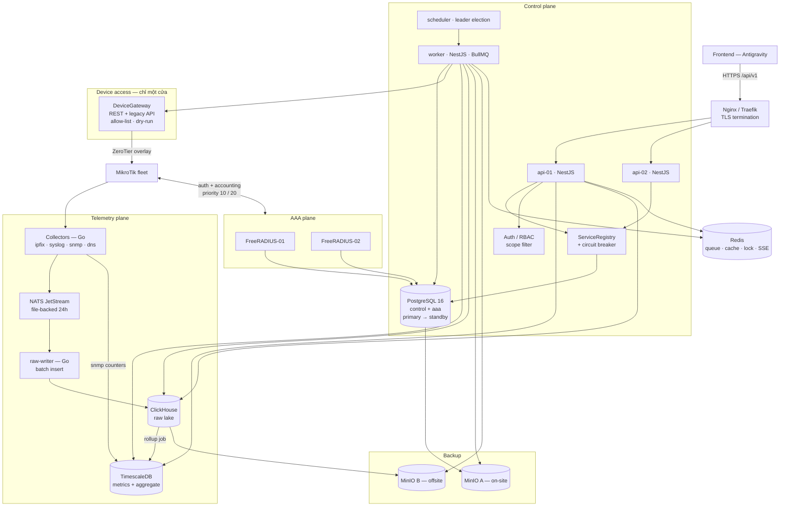

# Backend / Platform Design — MikroTik Centralized Fleet Management

**Version:** 0.1 (design only — chưa implement)
**Owner:** Claude (Backend/Platform agent)
**Ngày:** 2026-08-24
**Nguồn sự thật:** [SYSTEM_SPEC.md](../../SYSTEM_SPEC.md) · [AGENT_COLLABORATION.md](../../AGENT_COLLABORATION.md) · [HARDWARE_ZEROTIER_FLOW.md](../../HARDWARE_ZEROTIER_FLOW.md)

> Tài liệu này là **đề xuất kiến trúc để review**. Không có dòng code nào được viết, không có thiết bị MikroTik nào được cấu hình, không có secret hoặc IP production nào xuất hiện. Mọi địa chỉ trong ví dụ đều là logical service name hoặc dải tài liệu đã có sẵn trong spec.

---

## 0. Hiện trạng workspace

```text
F:\02-Managerment-mikrotik\
├── SYSTEM_SPEC.md             25.952 bytes   spec hệ thống v0.1
├── AGENT_COLLABORATION.md     16.614 bytes   contract-first workflow Claude <-> Antigravity
└── HARDWARE_ZEROTIER_FLOW.md  12.904 bytes   commissioning phần cứng + ZeroTier + RADIUS
```

**Kết luận:** workspace hiện chỉ có tài liệu. Chưa có `backend/`, `frontend/`, `contracts/`, `infra/`, `docs/`; chưa có git repo; chưa có toolchain. Đây là greenfield hoàn toàn — thuận lợi vì áp dụng được contract-first ngay từ commit đầu tiên, không phải migrate code cũ.

**Ba khoảng trống trong spec cần chốt trước khi code** (chi tiết ở §8 và [04-RISK_REGISTER.md](04-RISK_REGISTER.md)):

| # | Khoảng trống | Vì sao chặn | Đề xuất |
|---|---|---|---|
| G1 | Spec không nói HotSpot dùng login method nào | CHAP/MSCHAP buộc RADIUS phải giữ password ở dạng khôi phục được, đụng §13 "không lưu plaintext" | HTTPS + PAP, lưu password dạng hash. Xem ADR-08 |
| G2 | Spec không nói FastTrack có bật trên CREW/BUSINESS không | FastTrack bypass Traffic Flow, IPFIX mất phần lớn traffic, gap đối soát trở nên vô nghĩa | Tắt FastTrack trên CREW/BUSINESS. Xem R-01 |
| G3 | Spec không nói IPFIX export ở interface nào | Export ở WAN (sau srcnat) làm mất client IP, không correlate được identity | Export ở CREW/BUSINESS interface (pre-NAT). Xem R-02 |

---

## 1. Architecture Decision Records

### ADR-01 — Ngôn ngữ và runtime: NestJS (TypeScript) cho control plane, Go cho collector

**Quyết định.** Control plane API + worker viết bằng **NestJS 11 + TypeScript trên Fastify adapter**. Collector IPFIX / Syslog / SNMP / DNS viết bằng **Go 1.23**.

**Lý do.**

- `AGENT_COLLABORATION.md §3` bắt buộc contract-first với OpenAPI. Hệ sinh thái TypeScript có đường đi ngắn nhất từ `openapi.yaml` tới type an toàn ở cả backend lẫn frontend, và Antigravity đang làm frontend TS, nên hai bên dùng chung một bộ type generated thay vì hai bản dịch semantics khác nhau.
- NestJS cho sẵn DI, module boundary, guard/interceptor/exception-filter — đúng thứ cần để implement envelope `{data, meta, error}`, `request_id` và RBAC scope guard một lần rồi áp dụng toàn cục.
- Collector là bài toán khác hẳn: UDP socket, packet parsing, backpressure, zero-allocation hot path. Node.js `dgram` sẽ drop packet dưới burst IPFIX. Go cho goroutine + `net.ListenUDP` với `SO_RCVBUF` lớn, GC pressure thấp, binary tĩnh khoảng 15MB, không runtime dependency.
- Ngay ở quy mô nhỏ (dưới 20 tàu), IPFIX vẫn có thể đạt 2.000–5.000 flow/giây khi CREW đông. Đó là ngưỡng Node bắt đầu drop, còn Go thì chưa đổ mồ hôi.

**Trade-off chấp nhận.** Polyglot nghĩa là 2 toolchain, 2 CI pipeline, 2 bộ lint. Bù lại ranh giới rất rõ: Go **chỉ** ingest + parse + ghi raw, Go **không** chứa business logic. Dev backend hằng ngày chủ yếu chỉ đụng TypeScript.

**Phương án đã loại.**

- *NestJS toàn bộ*: đơn giản vận hành, nhưng collector là điểm nghẽn cứng, và sửa về sau nghĩa là viết lại collector giữa lúc đang có dữ liệu production.
- *Go toàn bộ*: tốc độ làm CRUD/dashboard API chậm hơn đáng kể, codegen OpenAPI kém thuận tiện, và mất lợi thế share type với Antigravity.

---

### ADR-02 — Ba tầng lưu trữ: PostgreSQL + TimescaleDB + ClickHouse

**Quyết định.**

| Logical service | Engine | Nội dung |
|---|---|---|
| `database.control` | PostgreSQL 16 | Inventory, RBAC, service registry, config template/revision, job, audit, alert, commissioning |
| `database.aaa` | PostgreSQL 16, schema riêng, cùng cluster control ở giai đoạn đầu | Schema FreeRADIUS: `radcheck`, `radreply`, `radgroupcheck`, `radusergroup`, `radacct`, `radpostauth`, `nas` |
| `database.analytics` | TimescaleDB 2.x, instance riêng | Interface counter + delta, device metric, RADIUS session/usage, mọi bảng aggregate, reconciliation, health result |
| `database.raw` / `storage.raw` | ClickHouse 24.x | Raw IPFIX / DNS / DHCP / Syslog / RADIUS event, `classified_flows`, drill-down |
| — | MinIO (S3 API) | Backup target A/B: RouterOS `.backup`/`.rsc`/`.umb`, DB dump, ClickHouse archive |
| — | Redis 7 | BullMQ queue, cache registry, distributed lock, SSE fan-out |
| — | NATS JetStream | Buffer bền cho telemetry giữa collector và writer |

**Vì sao tách ba tầng.**

- `SYSTEM_SPEC §2.2` yêu cầu raw immutable tách khỏi aggregate. Ba tầng biến điều đó thành ranh giới vật lý chứ không chỉ là quy ước dễ bị phá.
- **Vì sao giữ Timescale thay vì đẩy hết vào ClickHouse:** phép đối soát ở `§6.2` là join giữa interface counter, RADIUS usage và inventory (device / interface / zone / wan). Đây là join quan hệ nhiều chiều, cardinality thấp — Postgres/Timescale làm việc này tự nhiên, có foreign key thật, có transaction, có `time_bucket_gapfill` cho chuỗi thời gian thưa. Viết lại logic đó trong ClickHouse đồng nghĩa tự quản lý nhất quán bằng tay.
- **Vì sao cần ClickHouse thay vì đẩy hết vào Timescale:** raw IPFIX là high-cardinality (src_ip × dst_ip × port). Một tàu 200 CREW user sinh khoảng 150–400 GB flow mỗi năm chưa nén. ClickHouse nén cột thường đạt 8–15 lần trên dữ liệu này và quét range nhanh hơn 1–2 bậc. Postgres sẽ ngốn disk và chậm đúng ở thao tác quan trọng nhất: drill-down từ tổng số về raw record (`§15`).
- Analytics tách instance khỏi control để một query dashboard nặng không làm chậm job apply config.

**Trade-off.** Ba engine nghĩa là ba backup strategy, ba migration tool, ba bộ kỹ năng vận hành. Giảm nhẹ bằng: migration đều chạy qua một CLI thống nhất, backup đều đổ về cùng hai MinIO target, và ClickHouse chỉ có schema append-only nên migration đơn giản hơn Postgres nhiều.

**Ranh giới nghiêm ngặt.** Không join cross-engine trong application code theo kiểu N+1. Dữ liệu đi một chiều: `ClickHouse (raw) -> rollup job -> Timescale (aggregate) -> API`. Chỉ endpoint drill-down mới đọc thẳng ClickHouse, và luôn kèm `LIMIT` cùng cursor.

---

### ADR-03 — NATS JetStream làm buffer telemetry, Redis/BullMQ làm job queue

**Quyết định.** Hai hàng đợi cho hai mục đích khác nhau.

```text
Telemetry — một chiều, lượng lớn, cần replay:
  Collector (Go) -> NATS JetStream (file-backed, retention 24h) -> raw-writer (Go) -> ClickHouse

Control-plane job — ít, cần retry / priority / progress cho UI:
  API (Nest) -> BullMQ on Redis -> worker (Nest) -> DeviceGateway / DB
```

**Lý do.**

- `SYSTEM_SPEC §8.6` đặt RPO raw telemetry dưới 1 phút *"nếu collector còn buffer"*. JetStream file-backed chính là cái buffer đó: ClickHouse chết 30 phút thì collector vẫn nhận và ghi xuống đĩa, writer replay khi ClickHouse sống lại. Nếu collector ghi thẳng ClickHouse thì mất trắng.
- JetStream là một binary, khoảng 50MB RAM ở tải này, một dòng trong compose. Kafka thừa thãi cho dưới 20 tàu.
- Redis đằng nào cũng cần cho cache/lock/SSE, nên BullMQ là chi phí biên bằng không. Nhưng Redis persistence (AOF `everysec`) không đủ tin cậy cho raw telemetry — đó chính là lý do không gộp hai hàng đợi làm một.

**Fallback tại collector.** Nếu NATS không reachable, collector ghi ra local WAL segment file (capped size, drop-oldest kèm counter `wal_dropped_total`) và drain khi NATS trở lại. Không bao giờ block socket đọc.

**Lưu ý quan trọng.** JetStream **không phải** raw storage. Nó là buffer 24 giờ. Nguồn sự thật để reprocess theo `parser_version` mới (`SYSTEM_SPEC §11`) luôn là bảng raw trong ClickHouse.

---

### ADR-04 — Không hard-code địa chỉ: Service Registry hai tầng

**Bài toán vòng lặp.** `service_endpoints` nằm trong `database.control`, nhưng app cần biết địa chỉ `database.control` để đọc được bảng đó. Không thể giải bằng chính registry.

**Quyết định.** Chia config làm hai tầng, và **chỉ tầng 0 mới được dùng env var**.

```text
Tier 0 — Bootstrap (env / docker secret, danh sách rất ngắn, đóng băng):
  DATABASE_CONTROL_URLS      # danh sách có thứ tự: primary, standby
  SECRET_KEK_REF             # tham chiếu tới key mã hóa gốc
  NODE_ROLE                  # api | worker | scheduler
  (không có gì khác)

Tier 1 — Runtime (đọc từ bảng service_endpoints, cache Redis, hot-reload):
  radius.auth  radius.accounting
  database.analytics  database.raw
  collector.ipfix  collector.syslog  collector.snmp  collector.dns
  storage.raw  storage.backup.a  storage.backup.b
  bus.telemetry  cache.primary
  zerotier.controller
```

**API nội bộ.**

```ts
registry.resolve('radius.auth', { shipId })
// -> EndpointCandidate[] đã sắp theo priority, đã lọc theo health và ship_scope
// -> KHÔNG BAO GIỜ chứa secret; chỉ có secret_ref
```

**Cơ chế.**

- Mỗi logical service có N endpoint, sắp theo `priority` tăng dần, lọc `enabled = true` và `last_status IN (HEALTHY, DEGRADED)`.
- Circuit breaker cho từng endpoint: closed, mở sau K lỗi liên tiếp, half-open sau cooldown. Trạng thái breaker chia sẻ qua Redis để mọi instance thấy giống nhau.
- Thay đổi endpoint phát sự kiện Redis pub/sub, mọi process invalidate cache trong dưới 1 giây, không cần restart. Đúng yêu cầu `SYSTEM_SPEC §1.10`.
- `ship_scope` cho phép một tàu hoặc một khu vực dùng endpoint khác toàn hệ thống, ví dụ collector đặt tại khu vực.

**Lint rule bắt buộc trong CI.** Regex chặn IP literal và hostname có TLD trong `backend/src/**` và `backend/collectors/**`, chỉ whitelist file test và fixture. Đây là cách duy nhất giữ được `§15` "không có địa chỉ service quan trọng bị hard-code" khi codebase lớn dần.

---

### ADR-05 — Quản lý secret: envelope encryption, interface đổi được sang Vault

**Quyết định.** Định nghĩa interface `SecretProvider`, implement mặc định là `EnvelopeSecretProvider` (ciphertext trong `database.control`, KEK lấy từ Docker secret hoặc file quyền 0400), giữ đường mở sang Vault/OpenBao mà không phải sửa call site.

```text
secrets_store(ref, version, ciphertext, kek_id, nonce, algo)   <- chỉ ciphertext
secrets_metadata(ref, kind, scope, version, rotated_at, ...)   <- metadata query được
```

**Quy tắc không thương lượng.**

- `service_endpoints.secret_ref` và `devices.credential_ref` chỉ chứa **tham chiếu**, không chứa giá trị.
- Không DTO nào của API trả `secret`, `password`, `shared_secret`, `private_key`. Enforce bằng serializer interceptor có allow-list field, cộng một contract test quét toàn bộ response example tìm các key bị cấm.
- RADIUS shared secret là **per-NAS** (per device), không dùng chung một secret cho cả fleet. Có job rotate.
- Log redaction: một Pino serializer bọc toàn bộ, redact theo key pattern trước khi ghi.

**Vì sao chưa dùng Vault ngay.** Ở quy mô 1–2 VM, Vault thêm một SPOF cần unseal và một quy trình vận hành mới, trong khi lợi ích chính của nó (dynamic credential) chưa cần tới. Interface giữ cho việc chuyển sang Vault ở Phase 5 chỉ là thay một file implementation.

---

### ADR-06 — MikroTik adapter: REST API chính, legacy API dự phòng, mọi thay đổi đi qua Job

**Quyết định.** Một service duy nhất `DeviceGateway` là cửa ngõ *duy nhất* tới RouterOS. Không module nào khác được mở socket tới router.

```text
DeviceGateway
├── transport: RouterOsRestTransport   (v7, HTTPS qua ZeroTier overlay)   <- mặc định
├── transport: RouterOsApiTransport    (api-ssl)                          <- fallback
├── per-device: connection pool, rate limiter, timeout, retry + jitter, circuit breaker
├── command allow-list (tập read và tập write tách riêng)
└── dry-run mode (render + diff, không gửi)
```

**Mô hình cấu hình: declarative desired-state.**

```text
config_template (variable schema có kiểu)
  -> render thành .rsc
  -> so với export hiện tại của thiết bị -> diff
  -> Job apply: [backup] -> [deferred rollback armed] -> [apply] -> [verify] -> [commit | rollback]
  -> device_config_revisions (+1 revision, giữ rollback_of_revision_id)
```

**Cơ chế an toàn bắt buộc — deferred rollback.** Trước khi apply bất kỳ thay đổi nào chạm firewall / address / route / interface, job cài một `/system scheduler` trên chính router để tự restore backup sau N phút. Verify thành công thì job xóa scheduler đó. Nếu job làm mất đường quản trị, router tự cứu mình. Đây là điều kiện tiên quyết cho `HARDWARE_ZEROTIER_FLOW §8`, vốn yêu cầu rollback được ngay cả khi mất local management path.

**Vì sao REST là chính.** JSON thuần, dễ debug, dễ mock, không cần thư viện binary protocol. Legacy API giữ lại vì một số thao tác và một số version cũ chỉ có ở đó.

---

### ADR-07 — AAA: FreeRADIUS + SQL backend (Model B), User Manager là adapter tùy chọn

**Quyết định.** Chọn **Model B** của `SYSTEM_SPEC §8.3`: hai node FreeRADIUS 3.2 dùng chung `database.aaa` (PostgreSQL có replication). User Manager giữ vị trí adapter cho voucher và các kịch bản RouterOS-specific, không phải nơi chứa sự thật AAA.

```ts
interface AaaProvider {
  upsertUser(...); disableUser(...); setProfile(...);
  listSessions(...); disconnect(...);          // CoA / Disconnect-Request
  getUsage(...);
}
// impl A: FreeRadiusSqlProvider       <- mặc định, là nguồn sự thật
// impl B: MikrotikUserManagerProvider <- adapter, gọi REST API của router
```

**Lý do.**

- `SYSTEM_SPEC §8.3` và `HARDWARE_ZEROTIER_FLOW §3.1` đều cảnh báo không được giả định User Manager tự đồng bộ realtime giữa nhiều node. Model A (primary/standby + backup `.umb`) có RPO bằng chu kỳ backup, không đạt được `§8.6` RPO dưới 5 phút cho RADIUS config.
- FreeRADIUS + SQL cho HA thật: cả hai node đọc ghi cùng một database, `radacct` là một bảng duy nhất, nên accounting không bị phân mảnh khi failover và đối soát không phải merge hai nguồn.
- Failover phía router là native: `SYSTEM_SPEC §8.2` — RouterOS RADIUS client có thứ tự priority và `accounting-backup` riêng. Controller sinh cấu hình đó từ registry, không ai gõ tay.

**Trade-off.** Phải tự vận hành FreeRADIUS (`sites-enabled`, `rlm_sql`, dictionary MikroTik). Bù lại có toàn quyền kiểm soát và có `radpostauth` để dashboard đếm accept/reject/timeout thật thay vì suy đoán.

---

### ADR-08 — HotSpot dùng HTTPS + PAP để password lưu được dạng hash

**Đây là quyết định có hệ quả bảo mật lớn nhất trong toàn bộ thiết kế, và spec chưa đề cập tới.**

**Vấn đề.** MikroTik HotSpot mặc định `login-by=http-chap`. Với CHAP, RADIUS server phải có password ở dạng **khôi phục được** (cleartext hoặc NT-hash) để tính challenge response. Điều đó mâu thuẫn trực tiếp với tinh thần `SYSTEM_SPEC §13` về việc không lưu credential dạng plaintext.

**Quyết định.** Trang login HotSpot phục vụ qua **HTTPS** với certificate hợp lệ, dùng `login-by=http-pap`. PAP gửi password tới RADIUS bên trong RADIUS packet, FreeRADIUS so với hash lưu trong `radcheck` (`SSHA2-512-Password` hoặc `Crypt-Password` dạng bcrypt).

**Điều kiện kèm theo — thiếu bất kỳ điều nào thì quyết định này không còn an toàn:**

1. Trang login **bắt buộc** HTTPS, certificate hợp lệ, không cho fallback HTTP.
2. Đường router tới RADIUS **bắt buộc** đi trong ZeroTier overlay, và nên nâng lên RadSec (TCP/TLS) khi đã quản lý được certificate.
3. Shared secret per-NAS, đủ entropy (tối thiểu 32 ký tự ngẫu nhiên), rotate được.

**Nếu bên vận hành bắt buộc phải dùng CHAP** (ví dụ không triển khai được certificate trên tàu): phải chấp nhận lưu password dạng khôi phục được, và khi đó bắt buộc mã hóa cột ở tầng ứng dụng bằng `SecretProvider`, giới hạn quyền đọc ở mức `security-admin`, ghi audit mọi lần đọc. Đây là quyết định cần chữ ký của bên bảo mật, không phải mặc định kỹ thuật.

---

### ADR-09 — Semantics của số liệu: chốt một lần, viết thẳng vào contract

`AGENT_COLLABORATION.md §2` liệt kê "xác nhận timezone, units và semantics của metric" là trách nhiệm chung. Đây là nơi các hệ thống đối soát hay sai dấu nhất, nên chốt ngay:

| Khái niệm | Quy ước | Ghi chú |
|---|---|---|
| Timestamp | Lưu `timestamptz` UTC, API trả ISO 8601 kết thúc bằng `Z` | Không bao giờ trả local time |
| Tham số `timezone` | Chỉ ảnh hưởng **ranh giới bucket** của granularity `1d` | Aggregate luôn tính ở UTC; chỉ bucket ngày mới cần timezone |
| Dung lượng | Luôn là **byte**, field kết thúc bằng `_bytes` | Không KB, không bit |
| Tốc độ | Luôn là **bit trên giây**, field kết thúc bằng `_bps` | Đây là chỗ hay lẫn nhất với byte |
| Download (DL) | Traffic **đi tới** người dùng | |
| Upload (UL) | Traffic **đi từ** người dùng | |
| `Acct-Input-Octets` | Bằng **UL** của user | "Input" là từ góc nhìn NAS, không phải góc nhìn user |
| `Acct-Output-Octets` | Bằng **DL** của user | |
| `tx_byte` của CREW_ACCESS | Bằng **DL** của CREW | Router truyền ra cổng CREW |
| `rx_byte` của CREW_ACCESS | Bằng **UL** của CREW | |
| `rx_byte` của WAN_INPUT | Bằng **DL** của tàu | |
| Gigawords | `octets + (gigawords * 2^32)` | Bắt buộc; bỏ qua thì mọi session trên 4GB đều sai |
| Counter | Cumulative, delta tính ở server | Client không tự trừ |
| `data_freshness_seconds` | Lấy **max** của các nguồn đóng góp, kèm breakdown từng nguồn | Response phải nói rõ nguồn nào đang cũ |

Bảng này sẽ được nhúng nguyên văn vào phần `description` của các schema liên quan trong `contracts/openapi.yaml`, để Antigravity không phải đoán.

---

### ADR-10 — Delta engine và phát hiện counter reset

**Quyết định.** Interface counter lưu **cumulative thô**, delta tính bởi worker riêng, không tính tại query time.

```text
delta = current - previous
nếu current < previous            -> counter_reset = true, delta = current, quality = DEGRADED
nếu gap_seconds > 3 * poll_interval -> quality = DEGRADED, không nội suy (gapfill = null)
```

**Bắt buộc dùng counter 64-bit.** SNMP `ifInOctets` là 32-bit và wrap sau khoảng 34 giây ở 1 Gbps — ở chu kỳ poll 60 giây thì hoàn toàn vô dụng. Chỉ dùng `ifHCInOctets` / `ifHCOutOctets` (IF-MIB 64-bit). Nếu thiết bị không hỗ trợ HC counter, đánh dấu interface đó `counter_source = UNRELIABLE` và loại khỏi đối soát, thay vì cho ra số sai.

**Chống double counting.** Đây là yêu cầu `SYSTEM_SPEC §6.1` "không được cộng đồng thời bridge, VLAN và port thành viên". Enforce bằng ba lớp:

1. Cột `interfaces.counted_in_reconciliation boolean`.
2. Constraint và validation service: nếu một interface có `parent_interface_id`, và cả cha lẫn con đều `counted = true` trong cùng `accounting_group`, thì từ chối với mã `INTERFACE_DOUBLE_COUNT`.
3. Job kiểm tra định kỳ trên toàn fleet, sinh alert nếu topology thay đổi làm phát sinh vi phạm mới.

---

### ADR-11 — Đối soát: luôn trả gap kèm lý do và độ tin cậy, không bao giờ trả con số trần

`SYSTEM_SPEC §6.3` nói rõ chênh lệch không mặc định là lỗi. Thiết kế phản ánh điều đó ngay ở tầng API: `GET /ships/{id}/reconciliation` **không** có field `gap` đứng một mình.

```jsonc
{
  "crew_download_gap_bytes": 4183891234,
  "crew_download_gap_pct": 7.4,
  "gap_reasons": [                       // luôn là mảng có trọng số, không phải một verdict
    { "code": "DEVICE_NOT_LOGGED_IN", "estimated_bytes": 2900000000, "confidence": 0.62,
      "evidence": { "unauthenticated_hosts": 14 } },
    { "code": "FLOW_UNCLASSIFIED",    "estimated_bytes": 900000000,  "confidence": 0.41 },
    { "code": "BROADCAST_MULTICAST",  "estimated_bytes": 180000000,  "confidence": 0.85 }
  ],
  "unattributed_bytes": 203891234,
  "data_quality": { "score": 0.78, "counter_resets": 1, "missing_buckets": 0,
                    "flow_sampling_rate": 1, "radius_sessions_without_stop": 3 }
}
```

Bộ quy tắc quy kết chạy theo thứ tự, mỗi quy tắc "tiêu thụ" một phần gap và ghi lại bằng chứng. Phần còn dư đi vào `unattributed_bytes` — cố tình để lộ ra, vì đây mới là con số đáng điều tra.

Các mã lý do, khớp `SYSTEM_SPEC §6.3`: `MANAGEMENT_VPN`, `ROUTER_ORIGINATED`, `BROADCAST_MULTICAST`, `BUSINESS_WITHOUT_USER`, `DEVICE_NOT_LOGGED_IN`, `FLOW_UNCLASSIFIED`, `NAT_ASYMMETRIC`, `COUNTER_RESET`, `FLOW_LOSS_SAMPLING`, `FASTTRACK_BYPASS`.

---

### ADR-12 — Identity correlation: bảng temporal cộng thứ tự ưu tiên nguồn

**Quyết định.** `identity_bindings` là bảng temporal `[valid_from, valid_to)`, ghi bởi worker từ bốn nguồn, giải xung đột theo thứ tự:

```text
1. RADIUS accounting (Framed-IP-Address + Calling-Station-Id)   <- tin cậy nhất
2. HotSpot active host (đọc qua RouterOS API)
3. DHCP lease
4. ARP table                                                     <- chỉ để bổ khuyết MAC
```

Flow join với identity bằng `ASOF JOIN` trong ClickHouse trên `(ship_id, client_ip, event_time)`. Mọi binding đều mang `confidence` và `source`, và `classified_flows` giữ lại chúng để dashboard trả lời được câu "số này đến từ đâu".

**Ràng buộc thiết kế quan trọng: IP reuse.** Một IP DHCP được cấp lại cho user khác sau 10 phút là chuyện thường. Nếu join chỉ theo IP mà bỏ khoảng thời gian, usage sẽ bị gán nhầm người — và đây là loại lỗi không ai phát hiện ra cho tới khi có khiếu nại. `valid_to` phải được đóng ngay khi có `Acct-Stop` hoặc DHCP release, và mọi truy vấn phải đi qua điều kiện thời gian, không ngoại lệ.

---

### ADR-13 — Contract-first, tuyệt đối không sinh API từ schema

`AGENT_COLLABORATION.md §3` nói `contracts/openapi.yaml` là nguồn sự thật duy nhất. Thực thi bằng cách cố định chiều codegen:

```text
contracts/openapi.yaml  (viết tay, hai bên review)
   ├─> backend:  openapi-typescript -> types + zod schema -> validation pipe của Nest
   ├─> frontend: orval / openapi-typescript -> client + type (Antigravity chạy)
   ├─> mock:     Prism mock server (đọc contracts/examples/)
   └─> CI:       Schemathesis chạy contract test ngược lại backend thật
```

CI fail nếu implementation lệch contract. Không dùng `@nestjs/swagger` decorator để sinh ngược ra yaml — chiều đó cho phép backend đổi API mà quên báo, đúng thứ `§11 "Không được làm"` cấm.

---

## 2. Kiến trúc runtime



**Luồng realtime ngược về Frontend:** `worker` publish event, Redis pub/sub fan-out tới mọi instance `api-*` đang giữ SSE connection, đẩy xuống `/api/v1/events/stream`. Có `Last-Event-ID` để resume, và Antigravity giữ polling fallback theo `AGENT_COLLABORATION §6`.

---

## 3. Cấu trúc thư mục

Giữ nguyên 100% cấu trúc top-level mà `AGENT_COLLABORATION.md §4` đã chốt. Collector Go nằm **bên trong** `backend/` để không phá vỡ bảng ownership (Claude sở hữu `backend/`, Antigravity sở hữu `frontend/`).

```text
project-root/
├── backend/                                    <- Claude owns
│   ├── apps/
│   │   ├── api/                                NestJS HTTP API, mount các module
│   │   ├── worker/                             BullMQ consumer: job, health, rollup
│   │   └── scheduler/                          cron + leader election (Redis lock)
│   │
│   ├── modules/                                Feature module — một module ứng một nhóm endpoint
│   │   ├── auth/                               login, refresh, logout, me, permissions
│   │   ├── rbac/                               role, permission, scope assignment
│   │   ├── inventory/                          org, area, ship, device
│   │   ├── interfaces/                         interface, zone, vlan, wan-link, assign-zone
│   │   ├── reconciliation/                     ship reconciliation + drill-down
│   │   ├── crew/                               CREW user, session, usage, service, radius-health
│   │   ├── business/                           port, vlan, device, usage, flow
│   │   ├── flows/                              traffic flow dashboard + raw drill-down
│   │   ├── devices/                            device detail, health, config-revision, log, backup
│   │   ├── service-endpoints/                  registry CRUD, check, enable/disable, rollout, rollback
│   │   ├── health/                             health summary, per-service, per-endpoint
│   │   ├── jobs/                               job detail, cancel, rollback, list
│   │   ├── alerts/                             alert list, ack, resolve, rule
│   │   ├── audit/                              audit log query, export
│   │   ├── dashboard/                          global, area, ship aggregate
│   │   └── events/                             SSE stream + fan-out
│   │
│   ├── libs/                                   Không phụ thuộc ngược vào modules/
│   │   ├── common/                             envelope, error catalog, request-id (ALS), logger
│   │   ├── config/                             typed loader env -> zod, chỉ tier-0 bootstrap
│   │   ├── registry/                           ServiceRegistry, EndpointResolver, CircuitBreaker
│   │   ├── secrets/                            SecretProvider iface + Envelope impl + Vault impl
│   │   ├── auth/                               JWT strategy, guard, CASL policy, scope repository filter
│   │   ├── db-control/                         Drizzle client + repository (PostgreSQL)
│   │   ├── db-analytics/                       Timescale client + query builder
│   │   ├── db-raw/                             ClickHouse client + query builder + cursor pagination
│   │   ├── bus/                                NATS JetStream publisher / consumer wrapper
│   │   ├── mikrotik/                           DeviceGateway, RestTransport, ApiTransport, rsc renderer
│   │   ├── aaa/                                AaaProvider iface, FreeRadiusSql impl, UserManager impl
│   │   ├── reconciliation-engine/              delta, counter-reset, gap attribution rules
│   │   ├── identity/                           binding resolver, temporal join helper
│   │   ├── classification/                     domain / IP / ASN classifier + catalog loader
│   │   ├── health-checks/                      một checker cho mỗi service_type, kiểm tra chức năng
│   │   ├── job-engine/                         job, step, compensating step, idempotency, lease
│   │   ├── audit/                              audit writer, diff serializer
│   │   └── testing/                            fixture factory, MikroTik simulator, RADIUS simulator
│   │
│   ├── collectors/                             <- Go, vẫn thuộc ownership của Claude
│   │   ├── cmd/
│   │   │   ├── ipfix-collector/                UDP, NetFlow v9 + IPFIX
│   │   │   ├── syslog-collector/               UDP/TCP, RFC3164 + RFC5424
│   │   │   ├── snmp-poller/                    ifHC counter, device metric
│   │   │   ├── dns-collector/                  DNS log ingest
│   │   │   └── raw-writer/                     NATS -> ClickHouse batch insert
│   │   ├── internal/
│   │   │   ├── ingest/  parse/  buffer/  sink/  registry/  health/  wal/
│   │   └── go.mod
│   │
│   ├── migrations/
│   │   ├── control/                            Drizzle SQL migration
│   │   ├── analytics/                          hypertable, continuous aggregate, retention policy
│   │   ├── raw/                                ClickHouse DDL, TTL, dictionary
│   │   └── aaa/                                schema FreeRADIUS + index bổ sung
│   │
│   ├── test/
│   │   ├── unit/  integration/  contract/  e2e/
│   │   └── fixtures/                           dataset tổng hợp cho tối thiểu 3 tàu
│   │
│   ├── scripts/                                seed, reprocess-raw, rotate-secret, restore-test
│   ├── package.json  tsconfig.json  nest-cli.json  .eslintrc.cjs
│   └── Dockerfile.api  Dockerfile.worker  Dockerfile.collector
│
├── frontend/                                   <- Antigravity owns. Claude KHÔNG chạm.
│
├── contracts/                                  <- Claude đề xuất, hai bên review
│   ├── openapi.yaml                            nguồn sự thật duy nhất
│   ├── events.yaml                             SSE event + NATS subject schema
│   ├── errors.yaml                             catalog mã lỗi ổn định
│   └── examples/
│       ├── dashboard/  reconciliation/  crew/  business/
│       ├── health/  jobs/  alerts/  audit/  service-endpoints/
│       └── errors/
│
├── infra/                                      <- Claude owns
│   ├── compose/
│   │   ├── docker-compose.core.yml             api, worker, scheduler, pg, timescale, ch, redis, nats, minio
│   │   ├── docker-compose.ha.yml               thêm pg standby, freeradius-02, minio-b, pgbouncer
│   │   ├── docker-compose.mock.yml             prism, mikrotik-sim, radius-sim, seed
│   │   └── docker-compose.dev.yml              hot reload, expose port, debug
│   ├── postgres/                               config, pg_hba mẫu, streaming replication, pgbouncer
│   ├── timescale/                              tuning, retention, continuous aggregate policy
│   ├── clickhouse/                             config, TTL, storage tier
│   ├── freeradius/                             sites-available, mods-available/sql, dictionary.mikrotik
│   ├── nats/  redis/  minio/
│   ├── observability/                          prometheus, grafana dashboard, loki, alertmanager
│   ├── backup/                                 backup script, retention, restore-test job
│   └── zerotier/                               ghi chú quy hoạch mạng — KHÔNG chứa identity hoặc secret
│
├── docs/                                       <- chia sẻ
│   ├── backend/                                bốn tài liệu thiết kế này
│   ├── runbooks/                               failover, restore, rollout, incident
│   └── adr/                                    ADR bổ sung khi có quyết định mới
│
├── SYSTEM_SPEC.md
├── AGENT_COLLABORATION.md
└── HARDWARE_ZEROTIER_FLOW.md
```

**Ba quy tắc phụ thuộc, enforce bằng ESLint `import/no-restricted-paths`:**

1. `modules/*` được import `libs/*`. `libs/*` **không** được import `modules/*`.
2. `modules/A` **không** được import `modules/B`. Cần dùng chung thì đẩy xuống `libs/`.
3. Chỉ `libs/mikrotik` được nói chuyện với RouterOS. Chỉ `libs/db-*` được mở connection tới database.

---

## 4. Những phần cần mock trước

`AGENT_COLLABORATION.md §3` yêu cầu Antigravity dựng UI trên mock trước khi backend xong. Bốn lớp mock, theo thứ tự ưu tiên:

### Lớp 1 — Mock API cho Antigravity (ưu tiên cao nhất, cần ngay Sprint 0)

**Prism mock server** đọc thẳng `contracts/openapi.yaml` và `contracts/examples/`.

```text
docker compose -f infra/compose/docker-compose.mock.yml up prism
-> http://localhost:4010/api/v1/*   trả example đúng theo contract
```

Mỗi endpoint cần **tối thiểu 5 example**, vì Frontend DoD yêu cầu loading / empty / error / stale-data state:

| Example | Dùng cho |
|---|---|
| `success` | Happy path, dữ liệu đầy đủ |
| `empty` | Danh sách rỗng, hoặc tàu chưa có dữ liệu |
| `stale` | `data_freshness_seconds` lớn, UI phải cảnh báo |
| `partial` | Một nguồn thiếu (RADIUS ổn, IPFIX chết), `data_quality` thấp |
| `error` | Từng mã lỗi có ý nghĩa với UI |

Thứ tự viết example theo nhu cầu của Antigravity: `auth` -> `dashboard/global` -> `ships` -> ship dashboard -> `reconciliation` -> `crew` -> `health` -> `service-endpoints` -> `jobs` -> `alerts` -> `audit` -> `flows` -> `business`.

### Lớp 2 — Mock thiết bị MikroTik (bắt buộc, không thương lượng)

Ràng buộc số 9 của bạn: không cấu hình MikroTik thật. Nhưng backend vẫn phải test được đường apply config.

**`MikrotikSimulator`** — HTTP server mô phỏng RouterOS REST API, giữ state trong bộ nhớ:

```text
GET  /rest/system/resource        cpu, mem, uptime, version, arch, board-name
GET  /rest/interface              danh sách interface + counter tăng dần theo thời gian
GET  /rest/ip/address, /route, /firewall/filter
GET  /rest/ip/hotspot/active, /host
GET  /rest/radius, /rest/radius/monitor
GET  /rest/zerotier, /rest/zerotier/interface
POST /rest/execute                nhận .rsc, cập nhật state trong bộ nhớ

Chế độ lỗi bật được để test resilience:
  --fail=timeout          treo quá timeout
  --fail=auth             trả 401
  --fail=partial-apply    apply nửa chừng rồi lỗi, buộc phải rollback
  --fail=counter-reset    reset counter về 0, test ADR-10
  --latency=800ms         mô phỏng VSAT
  --version=6.49          test nhánh không có REST API
```

Simulator **không** kết nối mạng ra ngoài. Không cần thiết bị thật cho tới khi vào lab ở Phase 3.

### Lớp 3 — Mock RADIUS và telemetry generator

- `RadiusSimulator` — sinh record `radacct` và `radpostauth` hợp lệ cho N user trong M ngày, có cả các ca xấu cố ý: session thiếu `Acct-Stop`, gigawords wrap, interim trễ, IP reuse trong vòng 5 phút.
- `IpfixGenerator` — bắn flow UDP đúng format IPFIX vào collector, tốc độ và tỉ lệ sampling cấu hình được.
- `SyslogGenerator`, `SnmpAgentSim` — tương tự.

Đây cũng chính là fixture để **kiểm chứng công thức đối soát**: sinh dữ liệu với gap đã biết trước, chạy engine, kiểm tra engine tìm ra đúng gap và đúng lý do. Không thể test reconciliation bằng dữ liệu thật, vì dữ liệu thật không có đáp án.

### Lớp 4 — Mock hạ tầng phụ

| Thành phần | Mock bằng | Lý do |
|---|---|---|
| ZeroTier controller | HTTP stub trả member list và authorize | Không tạo network thật ở giai đoạn design |
| Secret manager | `EnvelopeSecretProvider` với KEK dev cố định trong `.env.example` | KEK dev không bao giờ rời khỏi compose local |
| Backup target B (offsite) | MinIO thứ hai trong compose | Test được logic hai target mà không cần cloud |
| SMTP / notification | Mailpit | Xem được email alert mà không gửi ra ngoài |
| SSE upstream | Fake event emitter | Antigravity test được realtime UI trước khi có worker |

### Những phần **không** mock

Đối soát, delta engine, identity correlation, classification chạy trên dữ liệu tổng hợp có đáp án biết trước, **nhưng bằng code thật**. Mock chúng sẽ giấu đi đúng những lỗi cần tìm.

---

## 5. Implementation phases

Gộp `SYSTEM_SPEC §14` (Phase 1–5) với `AGENT_COLLABORATION §9` (Sprint 0–5). Mỗi phase có exit criteria kiểm chứng được bằng test tự động.

### Sprint 0 — Contract và Skeleton

Nền móng; mọi thứ phía sau đều dựa vào đây.

**Claude làm:**

- `contracts/openapi.yaml` skeleton: envelope, error schema, security scheme, toàn bộ path (chưa cần đủ mọi field).
- `contracts/errors.yaml` — catalog mã lỗi ổn định.
- Mô hình auth và RBAC (role, permission, scope).
- Example cho khoảng 15 endpoint quan trọng nhất, Prism mock chạy được.
- `docker-compose.core.yml` và `docker-compose.mock.yml` khởi động sạch từ máy trống.
- Skeleton NestJS: envelope interceptor, exception filter, request-id ALS, logger có redaction.
- CI: lint, typecheck, contract lint (Spectral), lint chặn hard-code IP và secret.

**Exit criteria:** Antigravity chạy `generate:client` ra được TS client, gọi được Prism mock, dựng được page đầu tiên trong khi backend chưa có business logic nào.

**Rủi ro nếu bỏ qua:** Antigravity phải đoán API, đúng thứ `§11 "Không được làm"` cấm.

---

### Phase 1 / Sprint 1 — Foundation: Inventory, Registry, Health

- Migration `control`: org, area, ship, device, interface, zone, vlan, wan_link, user/role/permission, service_endpoints, audit_logs, jobs.
- CRUD Area/Ship/Device/Interface cùng RBAC scope filter (`area:{id}`, `ship:{id}`).
- ServiceRegistry, EndpointResolver, circuit breaker, hot-reload qua Redis pub/sub.
- Health check **chức năng** cho từng service type theo `SYSTEM_SPEC §10.3`, không chỉ TCP.
- `DeviceGateway` cùng `MikrotikSimulator`, mở đường read-only trước.
- Backup RouterOS: binary, export, `.umb`; đẩy về hai MinIO target kèm checksum.
- Job engine và audit writer.

**Exit criteria:**

- Tạo được Area, Ship, Device qua API; permission bị chặn đúng khi sai scope.
- Khai báo được từ hai endpoint trở lên cho `radius.auth`; đổi host/port từ API; process khác nhìn thấy thay đổi trong dưới 1 giây mà không restart.
- Health check RADIUS gửi được synthetic Access-Request và báo RTT.
- Backup của simulator xuất hiện ở cả hai MinIO với checksum khớp.

---

### Phase 2 / Sprint 2 — Ship Dashboard và Đối soát

- SNMP poller (Go), chỉ dùng `ifHC*` counter.
- Delta engine và phát hiện counter reset (ADR-10).
- Validation chống double-count interface (ADR-10).
- Reconciliation engine và bộ quy tắc quy kết gap (ADR-11).
- Timescale hypertable, continuous aggregate cho `interface_traffic_5m/1h/1d`.
- Dashboard aggregate API: global, area, ship.

**Exit criteria:** với một dataset tổng hợp có gap **đã biết trước**, engine tính ra gap sai số dưới 1% và gán đúng ít nhất 80% lượng gap vào đúng `gap_reason`.

Đây là exit criteria quan trọng nhất của cả dự án. Không đạt thì mọi dashboard phía sau đều không đáng tin, và không ai phát hiện ra cho tới khi có tranh chấp về số liệu.

---

### Phase 3 / Sprint 3 — CREW AAA

- FreeRADIUS 3.2 hai node, schema `aaa`, dictionary MikroTik.
- `AaaProvider` (FreeRadiusSql): CRUD user, profile, limitation.
- Ingest accounting: Start / Interim / Stop; xử lý gigawords; xử lý session thiếu Stop.
- `user_usage_hourly` và `user_usage_daily`.
- CoA và Disconnect.
- CREW API cùng dashboard RADIUS health (accept/reject/timeout/RTT lấy từ `radpostauth`).

**Exit criteria:** `RadiusSimulator` đăng nhập 200 user ảo; tổng usage aggregate khớp tổng `radacct` chính xác tới từng byte; giả lập RADIUS-01 chết thì request chuyển sang RADIUS-02 và accounting không mất record.

**Đây là điểm sớm nhất nên đưa một tàu lab thật vào**, theo đúng quy trình `HARDWARE_ZEROTIER_FLOW §6`: một tàu mẫu, có backup, có local recovery path.

---

### Phase 4 / Sprint 4 — BUSINESS và Traffic Flow

- Collector IPFIX, DNS, Syslog (Go); NATS; raw-writer; ClickHouse.
- Identity correlation (ADR-12).
- Classification domain/IP/ASN kèm `classification_confidence` và `unknown_reason`.
- `classified_flows` và drill-down có cursor pagination.
- BUSINESS API: port, VLAN, device, usage, flow.
- Reprocess raw theo `parser_version` mới.

**Exit criteria:** drill-down từ một ô KPI trên dashboard xuống tới raw record trong tối đa 3 lần click và dưới 2 giây; đổi `parser_version` rồi reprocess cho kết quả nhất quán mà không mất raw.

---

### Phase 5 / Sprint 5 — HA và Operations

- Postgres streaming replication, pgBouncer, runbook promote.
- Backup encryption, retention, **test restore tự động**, alert khi backup quá hạn hoặc size giảm bất thường.
- Staged rollout endpoint theo batch area/ship, verify, rollback theo `SYSTEM_SPEC §9.2`.
- Alert engine, rule, SSE, notification.
- Toàn bộ failover drill của `HARDWARE_ZEROTIER_FLOW §7`.

**Exit criteria:** chạy hết `SYSTEM_SPEC §15`, đặc biệt hai bài diễn tập mất RADIUS-01 và mất database primary.

---

## 6. Đối chiếu ràng buộc bạn đặt ra

| Ràng buộc | Trạng thái | Bằng chứng |
|---|---|---|
| 1. Kiểm tra toàn bộ workspace | Đạt | §0 — ba file, chưa có code |
| 2. Đề xuất stack | Đạt | ADR-01 tới ADR-03 |
| 3. Cấu trúc thư mục backend | Đạt | §3 |
| 4. Database schema ban đầu | Đạt | [02-DATABASE_DESIGN.md](02-DATABASE_DESIGN.md) |
| 5. OpenAPI contract 11 module | Đạt | [03-API_DESIGN.md](03-API_DESIGN.md) |
| 6. Phần cần mock trước | Đạt | §4 — bốn lớp mock |
| 7. Rủi ro kỹ thuật | Đạt | [04-RISK_REGISTER.md](04-RISK_REGISTER.md) — 22 rủi ro |
| 8. Không sửa Frontend | Đạt | Không có file nào dưới `frontend/`; §3 ghi rõ "Claude KHÔNG chạm" |
| 9. Không cấu hình MikroTik thật | Đạt | §4 lớp 2 dùng `MikrotikSimulator`; không lệnh RouterOS nào được chạy |
| 10. Không secret hoặc IP production | Đạt | ADR-04, ADR-05. Ví dụ chỉ dùng logical name và dải `10.250.0.0/16` vốn đã là địa chỉ ví dụ trong `HARDWARE_ZEROTIER_FLOW §4.2` |
| Chưa code ngay | Đạt | Không tạo file `.ts`, `.go`, `.sql` nào |

---

## 7. Các file dự kiến sẽ tạo

### Đã tạo ở bước này (design)

```text
docs/backend/01-BACKEND_DESIGN.md      <- file này
docs/backend/02-DATABASE_DESIGN.md
docs/backend/03-API_DESIGN.md
docs/backend/04-RISK_REGISTER.md
```

### Sprint 0 — sau khi bạn duyệt thiết kế này

```text
contracts/openapi.yaml
contracts/errors.yaml
contracts/events.yaml
contracts/examples/**/*.json                  khoảng 75 file (15 endpoint x 5 state)

backend/package.json  tsconfig.json  nest-cli.json  .eslintrc.cjs
backend/apps/api/src/main.ts  app.module.ts
backend/apps/worker/src/main.ts
backend/apps/scheduler/src/main.ts
backend/libs/common/src/{envelope.interceptor,error.filter,request-context,logger}.ts
backend/libs/config/src/{schema,loader}.ts
backend/libs/auth/src/{jwt.strategy,rbac.guard,scope.filter,policy}.ts
backend/libs/registry/src/{service-registry,endpoint-resolver,circuit-breaker}.ts
backend/libs/secrets/src/{provider.interface,envelope.provider}.ts
backend/libs/testing/src/{fixture-factory,mikrotik-simulator,radius-simulator}.ts

backend/migrations/control/0001_init_inventory.sql
backend/migrations/control/0002_rbac.sql
backend/migrations/control/0003_service_registry.sql
backend/migrations/control/0004_jobs_audit.sql

infra/compose/docker-compose.{core,mock,dev}.yml
infra/{postgres,timescale,clickhouse,redis,nats,minio}/**
.github/workflows/{backend-ci,contract-ci}.yml
```

### Sprint 1 tới 5 — tạo dần theo phase

```text
backend/modules/{auth,rbac,inventory,interfaces,devices,service-endpoints,health,
                 jobs,audit,dashboard,events,reconciliation,crew,business,flows,alerts}/**
backend/libs/{mikrotik,aaa,db-control,db-analytics,db-raw,bus,job-engine,audit,
              reconciliation-engine,identity,classification,health-checks}/**
backend/collectors/cmd/{ipfix,syslog,snmp,dns,raw-writer}-*/main.go
backend/collectors/internal/{ingest,parse,buffer,sink,registry,health,wal}/**
backend/migrations/analytics/**   backend/migrations/raw/**   backend/migrations/aaa/**
backend/test/{unit,integration,contract,e2e}/**
backend/scripts/{seed,reprocess-raw,rotate-secret,restore-test}.ts
infra/freeradius/**  infra/observability/**  infra/backup/**
infra/compose/docker-compose.ha.yml
docs/runbooks/{radius-failover,db-failover,restore-test,staged-rollout,incident}.md
```

---

## 8. Việc cần bạn quyết trước khi Sprint 0 bắt đầu

| # | Câu hỏi | Vì sao chặn | Mặc định nếu bạn không chốt |
|---|---|---|---|
| Q1 | HotSpot dùng HTTPS + PAP (password lưu hash) hay CHAP (password lưu dạng khôi phục được)? | ADR-08, quyết định bảo mật lớn nhất | HTTPS + PAP |
| Q2 | FastTrack có được tắt trên CREW/BUSINESS không? | Không tắt thì IPFIX vô nghĩa, đối soát chỉ còn dựa được vào counter | Tắt trên CREW/BUSINESS |
| Q3 | Retention: raw IPFIX và DNS giữ bao lâu? | Ảnh hưởng sizing disk và nghĩa vụ pháp lý về dữ liệu duyệt web của thuyền viên | 30 ngày raw, 13 tháng aggregate |
| Q4 | ZeroTier là lựa chọn chốt, hay cần WireGuard làm phương án dự phòng? | ZeroTier trên RouterOS chỉ có ARM/ARM64 v7 và bị device-mode chặn theo `HARDWARE_ZEROTIER_FLOW §3.3` | Thiết kế transport-agnostic, hỗ trợ cả hai |
| Q5 | Có tàu lab thật để dùng ở Phase 3 không, model gì? | Quyết định thời điểm rời khỏi simulator | Giả định chưa có; kéo dài simulator tới hết Phase 4 |
