# Database Design v0.1

**Trạng thái:** thiết kế, chưa sinh migration
**Liên quan:** [01-BACKEND_DESIGN.md](01-BACKEND_DESIGN.md) ADR-02, ADR-10, ADR-12 · `SYSTEM_SPEC.md §11`

> Ký hiệu: `PK` khóa chính · `FK` khóa ngoại · `UQ` unique · `IX` index · `→` tham chiếu

---

## 0. Bản đồ bốn store

```mermaid
flowchart LR
    subgraph PG["PostgreSQL 16 — database.control"]
        C1["Identity & RBAC"]
        C2["Inventory<br/>org · area · ship · device · interface"]
        C3["Service registry<br/>+ rollout + revision"]
        C4["Config template<br/>+ device revision + backup"]
        C5["Job · Audit · Alert"]
        C6["Secrets store<br/>(chỉ ciphertext)"]
    end
    subgraph AAA["PostgreSQL — schema aaa"]
        A1["FreeRADIUS<br/>radcheck · radreply · radacct · radpostauth · nas"]
        A2["crew_users · radius_profiles<br/>(app-owned)"]
    end
    subgraph TS["TimescaleDB — database.analytics"]
        T1["interface_counters<br/>interface_deltas"]
        T2["device_metrics · wan_quality"]
        T3["radius_sessions<br/>identity_bindings"]
        T4["*_usage_hourly / daily<br/>wan_reconciliation_hourly"]
        T5["health_check_results<br/>data_freshness"]
    end
    subgraph CH["ClickHouse — database.raw"]
        R1["raw_ipfix_flows · raw_dns_events<br/>raw_dhcp_events · raw_syslog_events<br/>raw_radius_events · raw_interface_counters"]
        R2["classified_flows"]
        R3["dict: ip_asn · domain_category<br/>identity_binding"]
    end

    PG -->|inventory sync| TS
    PG -->|dictionary sync| CH
    AAA -->|accounting ETL| TS
    CH -->|rollup job| TS
    TS --> API["API"]
    CH -->|drill-down only| API
```



**Quy tắc dòng chảy.** Dữ liệu đi một chiều: raw ở ClickHouse, rollup lên Timescale, API đọc Timescale. Chỉ endpoint drill-down mới chạm ClickHouse và luôn có `LIMIT` cùng cursor. Không có join cross-engine trong application code.

---

## 1. PostgreSQL — `database.control`

### 1.1. Identity và RBAC

```sql
users(
  id            uuid PK,
  email         citext UQ NOT NULL,
  display_name  text NOT NULL,
  password_hash text NOT NULL,           -- argon2id
  status        user_status NOT NULL,    -- ACTIVE | SUSPENDED | LOCKED
  mfa_secret_ref text NULL,              -- → secrets_store.ref, không phải giá trị
  failed_login_count int NOT NULL DEFAULT 0,
  locked_until  timestamptz NULL,
  last_login_at timestamptz NULL,
  created_at, updated_at timestamptz NOT NULL
)

roles(id uuid PK, code text UQ, name text, description text, is_builtin bool)
-- builtin theo SYSTEM_SPEC §13:
--   viewer · operator · network-admin · security-admin · platform-admin

permissions(id uuid PK, code text UQ, description text)
-- code dạng "<resource>:<action>", ví dụ:
--   inventory:read  inventory:write  device:config-apply  device:config-rollback
--   crew:read  crew:write  crew:disconnect
--   endpoint:read  endpoint:write  endpoint:rollout
--   raw:read  audit:read  alert:ack  job:cancel  secret:read

role_permissions(role_id FK→roles, permission_id FK→permissions, PK(role_id, permission_id))

user_role_assignments(
  id uuid PK,
  user_id FK→users,
  role_id FK→roles,
  scope_type scope_type NOT NULL,        -- ORG | AREA | SHIP
  scope_id  uuid NULL,                   -- NULL khi scope_type = ORG
  granted_by FK→users, granted_at timestamptz,
  UQ(user_id, role_id, scope_type, scope_id)
)

api_tokens(id uuid PK, user_id FK, name, token_hash UQ, scopes jsonb,
           expires_at, last_used_at, revoked_at, created_at)

refresh_tokens(id uuid PK, user_id FK, family_id uuid, token_hash UQ,
               expires_at, revoked_at, replaced_by uuid NULL,
               user_agent, ip inet, created_at)
IX(user_id, family_id)
```

**Ghi chú thiết kế.**

- Refresh token dùng **rotation có phát hiện tái sử dụng**: mỗi lần refresh sinh token mới cùng `family_id` và đặt `replaced_by`. Nếu một token đã có `replaced_by` lại được dùng lần nữa thì cả `family_id` bị thu hồi — dấu hiệu token bị đánh cắp.
- Scope resolve theo thứ tự bao trùm: quyền `ORG` bao `AREA`, quyền `AREA` bao mọi `SHIP` trong khu vực. Union các permission, không có deny rule — deny rule khiến việc suy luận quyền trở nên khó kiểm chứng, và spec không cần tới nó.

---

### 1.2. Inventory

```sql
organizations(id uuid PK, code text UQ, name, settings jsonb, created_at, updated_at)

areas(
  id uuid PK, org_id FK→organizations,
  code text NOT NULL, name text NOT NULL,
  timezone text NOT NULL DEFAULT 'UTC',   -- IANA
  geo jsonb NULL,
  UQ(org_id, code)
)

ships(
  id uuid PK, area_id FK→areas,
  code text NOT NULL, name text NOT NULL,
  imo text NULL, mmsi text NULL,
  status ship_status NOT NULL,            -- PLANNED | COMMISSIONING | ACTIVE | MAINTENANCE | DECOMMISSIONED
  timezone text NOT NULL,
  crew_capacity int NULL,
  commissioned_at timestamptz NULL,
  UQ(area_id, code)
)
IX(area_id, status)

devices(
  id uuid PK, ship_id FK→ships,
  code text NOT NULL, name text NOT NULL,
  role device_role NOT NULL,              -- EDGE | CORE | SWITCH | AP | CPE
  model, serial, architecture text NULL,  -- điền khi discovery
  routeros_version text NULL,
  device_mode text NULL,                  -- HARDWARE_ZEROTIER_FLOW §3.3
  api_transport transport NOT NULL DEFAULT 'REST',   -- REST | API_SSL | API
  credential_ref text NULL,               -- → secrets_store.ref
  mgmt_endpoint_ref text NULL,            -- → tên logical, KHÔNG phải IP
  zerotier_member_id FK→zerotier_members NULL,
  status device_status NOT NULL,          -- UNKNOWN | ONLINE | DEGRADED | OFFLINE | MAINTENANCE
  last_seen_at timestamptz NULL,
  poll_interval_s int NOT NULL DEFAULT 60,
  UQ(ship_id, code)
)
IX(ship_id, role), IX(status, last_seen_at)
```

**Vì sao không có cột `ip_address` trên `devices`.** `SYSTEM_SPEC §1.10` và `§9.3` cấm hard-code địa chỉ. Địa chỉ quản trị của thiết bị đến từ `zerotier_members.assigned_ip` (do controller cấp) hoặc từ một service endpoint có scope tàu. Đặt IP trực tiếp lên `devices` là mở đường cho việc sửa tay từng thiết bị — đúng thứ `§9.2` cấm.

```sql
device_commissioning_records(       -- HARDWARE_ZEROTIER_FLOW §9
  id uuid PK, device_id FK→devices UQ,
  model, serial, architecture, routeros_version, device_mode text,
  wan_interface_ids uuid[], crew_interface_ids uuid[], business_interface_ids uuid[],
  management_interface_id uuid NULL,
  radius_endpoint_ids uuid[], collector_endpoint_ids uuid[],
  last_backup_at, last_health_check_at timestamptz,
  commissioned_by FK→users, commissioned_at timestamptz,
  rollback_revision_id FK→device_config_revisions NULL,
  checklist jsonb                   -- từng bước của §6 với timestamp và người thực hiện
)

network_zones(
  id uuid PK, ship_id FK→ships,
  kind zone_kind NOT NULL,          -- CREW | BUSINESS | MANAGEMENT
  name text, description text,
  UQ(ship_id, kind, name)
)

vlan_definitions(
  id uuid PK, ship_id FK→ships,
  vlan_id int NOT NULL CHECK (vlan_id BETWEEN 1 AND 4094),
  name text, zone_id FK→network_zones,
  cidr cidr NULL, gateway inet NULL,
  UQ(ship_id, vlan_id)
)

interfaces(
  id uuid PK, device_id FK→devices,
  name text NOT NULL,                          -- ether1, vlan100, bridge-crew
  type interface_type NOT NULL,                -- ETHER | VLAN | BRIDGE | WIREGUARD | ZEROTIER | LTE | SFP | PPPOE
  mac macaddr NULL,
  parent_interface_id FK→interfaces NULL,      -- VLAN → ether cha, bridge member → bridge
  vlan_definition_id FK→vlan_definitions NULL,
  zone_id FK→network_zones NULL,
  snmp_index int NULL,
  speed_bps bigint NULL, mtu int NULL,
  admin_state, oper_state link_state,          -- UP | DOWN | UNKNOWN
  accounting_group accounting_group NOT NULL DEFAULT 'NONE',
      -- WAN_INPUT | CREW_ACCESS | BUSINESS_ACCESS | MANAGEMENT | NONE   (SYSTEM_SPEC §6.1)
  counted_in_reconciliation bool NOT NULL DEFAULT false,
  counter_source counter_source NOT NULL DEFAULT 'UNKNOWN',
      -- HC64 | LEGACY32 | API | UNRELIABLE      (ADR-10)
  UQ(device_id, name)
)
IX(device_id, accounting_group) WHERE counted_in_reconciliation
```

**Constraint chống double counting** — hiện thực của `SYSTEM_SPEC §6.1` và ADR-10:

```sql
-- Không thể biểu diễn hoàn toàn bằng CHECK constraint (cần đọc hàng cha),
-- nên dùng trigger + job kiểm tra định kỳ:

CREATE TRIGGER trg_interface_no_double_count
  BEFORE INSERT OR UPDATE ON interfaces
  -- Từ chối nếu NEW.counted_in_reconciliation = true
  -- VÀ tồn tại tổ tiên (đệ quy theo parent_interface_id) cũng counted = true
  --     trong cùng accounting_group
  -- → raise INTERFACE_DOUBLE_COUNT

-- Job hằng ngày quét lại toàn fleet: topology có thể thay đổi từ phía thiết bị
-- (thêm bridge member mới) mà không đi qua API, nên trigger một mình là chưa đủ.
```

```sql
wan_links(
  id uuid PK, ship_id FK→ships,
  name text NOT NULL,
  kind wan_kind NOT NULL,              -- VSAT | LTE | FIBER | STARLINK | OTHER
  interface_id FK→interfaces UQ,
  capacity_down_bps bigint NULL, capacity_up_bps bigint NULL,
  priority int NOT NULL,               -- 1 = chính
  sla jsonb NULL,                      -- {max_rtt_ms, max_loss_pct, monthly_quota_bytes}
  enabled bool NOT NULL DEFAULT true,
  UQ(ship_id, name)
)

zerotier_networks(id uuid PK, network_id text UQ, name, cidr cidr,
                  controller_endpoint_id FK→service_endpoints,
                  api_token_ref text)         -- → secrets_store.ref

zerotier_members(
  id uuid PK, zerotier_network_id FK→zerotier_networks,
  device_id FK→devices UQ,
  node_id text NOT NULL,
  assigned_ip inet NULL,
  authorized bool NOT NULL DEFAULT false, authorized_at timestamptz NULL,
  last_seen_at timestamptz NULL,
  UQ(zerotier_network_id, node_id)
)
```

---

### 1.3. Service registry — `SYSTEM_SPEC §9.1`

```sql
service_endpoints(
  id uuid PK,
  service_name text NOT NULL,            -- radius.auth · database.analytics · collector.ipfix ...
  service_type service_type NOT NULL,    -- RADIUS | RADIUS_ACCT | DATABASE | COLLECTOR | STORAGE
                                         -- | USER_MANAGER | CONTROLLER | BUS | CACHE | ZEROTIER
  environment text NOT NULL,             -- dev | staging | prod
  host text NOT NULL, port int NOT NULL,
  protocol text NOT NULL,                -- radius | radsec | postgres | clickhouse | https | s3 | nats
  priority int NOT NULL,                 -- nhỏ hơn = ưu tiên hơn (SYSTEM_SPEC §8.2)
  enabled bool NOT NULL DEFAULT true,
  region text NULL,
  ship_scope jsonb NOT NULL DEFAULT '{"type":"ALL"}',
      -- {"type":"ALL"} | {"type":"AREA","ids":[...]} | {"type":"SHIP","ids":[...]}
  healthcheck_type healthcheck_type NOT NULL,
      -- RADIUS_ACCESS_REQUEST | RADIUS_ACCT_PROBE | SQL_RW | CLICKHOUSE_PING
      -- | FLOW_RECENCY | POLL_RECENCY | S3_RW | HTTP_FUNCTIONAL | NATS_RTT
  healthcheck_interval_s int NOT NULL DEFAULT 30,
  timeout_ms int NOT NULL DEFAULT 5000,
  secret_ref text NULL,                  -- KHÔNG BAO GIỜ chứa giá trị secret
  tls jsonb NULL,                        -- {verify, ca_ref, cert_ref, sni}
  last_status health_status NOT NULL DEFAULT 'UNKNOWN',
      -- HEALTHY | DEGRADED | UNHEALTHY | UNKNOWN | MAINTENANCE  (SYSTEM_SPEC §10.1)
  last_check_at, last_success_at timestamptz NULL,
  failure_count int NOT NULL DEFAULT 0,
  config_version int NOT NULL DEFAULT 1,
  created_at, updated_at timestamptz,
  UQ(service_name, environment, host, port, protocol)
)
IX(service_name, enabled, priority)

service_endpoint_revisions(
  id uuid PK, endpoint_id FK→service_endpoints,
  version int NOT NULL, payload jsonb NOT NULL,   -- snapshot đầy đủ, không phải diff
  change_reason text NOT NULL, changed_by FK→users,
  created_at timestamptz,
  UQ(endpoint_id, version)
)

service_rollouts(                        -- SYSTEM_SPEC §9.2
  id uuid PK, service_name text NOT NULL,
  from_version int, to_version int,
  scope jsonb NOT NULL,                  -- ALL | AREA[] | SHIP[]
  strategy rollout_strategy NOT NULL,    -- CANARY | BATCHED | ALL_AT_ONCE
  batch_size int, batch_delay_s int,
  status rollout_status NOT NULL,        -- PLANNED | VALIDATING | STAGED | APPLYING
                                         -- | VERIFYING | COMMITTED | ROLLING_BACK | ROLLED_BACK | FAILED
  job_id FK→jobs NULL,
  validation_result jsonb,               -- DNS/IP/port/certificate check
  verification_result jsonb,             -- auth + accounting + telemetry sau khi apply
  created_by FK→users, started_at, finished_at timestamptz
)

service_health_state(                    -- trạng thái hiện tại, dung lượng nhỏ, đọc rất nhiều
  endpoint_id FK→service_endpoints PK,
  status health_status NOT NULL,
  since timestamptz NOT NULL,
  consecutive_failures int NOT NULL DEFAULT 0,
  breaker_state breaker_state NOT NULL,  -- CLOSED | OPEN | HALF_OPEN
  breaker_opened_at timestamptz NULL,
  is_active bool NOT NULL,               -- endpoint đang được chọn cho service này
  last_error jsonb NULL,
  last_rtt_ms int NULL
)
```

**Vì sao tách `service_health_state` khỏi `service_endpoints`.** Health check ghi mỗi 30 giây cho mỗi endpoint. Nếu ghi thẳng vào `service_endpoints` thì bảng cấu hình bị bloat vì UPDATE liên tục, autovacuum phải chạy suốt, và mọi truy vấn cấu hình đều đụng vào hàng đang bị ghi. Tách ra: bảng cấu hình gần như bất biến, bảng trạng thái nhỏ và nóng. Kết quả check theo thời gian đi vào `health_check_results` ở Timescale (§3.5).

---

### 1.4. Config template, revision, backup

```sql
config_templates(
  id uuid PK, name text NOT NULL, version int NOT NULL,
  target_role device_role NOT NULL,
  engine template_engine NOT NULL,       -- HANDLEBARS
  body text NOT NULL,
  variables_schema jsonb NOT NULL,       -- JSON Schema cho biến, validate lúc render
  checksum text NOT NULL,
  status template_status NOT NULL,       -- DRAFT | APPROVED | DEPRECATED
  approved_by FK→users NULL, approved_at timestamptz NULL,
  UQ(name, version)
)

device_config_revisions(
  id uuid PK, device_id FK→devices,
  revision_no int NOT NULL,
  source revision_source NOT NULL,       -- IMPORT | APPLY | ROLLBACK | DRIFT_DETECTED
  template_id FK→config_templates NULL, template_vars jsonb NULL,
  rendered_config_ref text NULL,         -- → object storage (không nhét .rsc vào Postgres)
  export_hash text NOT NULL,             -- hash của export thực tế đọc từ thiết bị
  diff_ref text NULL,
  applied_job_id FK→jobs NULL, applied_by FK→users NULL, applied_at timestamptz,
  is_current bool NOT NULL DEFAULT false,
  rollback_of_revision_id FK→device_config_revisions NULL,
  UQ(device_id, revision_no)
)
UQ(device_id) WHERE is_current    -- partial unique: đúng một revision hiện hành

device_backups(
  id uuid PK, device_id FK→devices,
  kind backup_kind NOT NULL,             -- BINARY | EXPORT | UMB | CERTIFICATE
  size_bytes bigint, checksum_sha256 text NOT NULL,
  encrypted bool NOT NULL DEFAULT true, encryption_key_ref text,
  storage_targets jsonb NOT NULL,        -- [{target:"storage.backup.a", key:"...", verified_at:"..."}]
  created_by_job_id FK→jobs, created_at timestamptz,
  expires_at timestamptz NULL,
  restore_tested_at timestamptz NULL,
  restore_test_result restore_result NULL -- PASSED | FAILED | NOT_TESTED
)
IX(device_id, kind, created_at DESC)
```

**Ràng buộc từ `SYSTEM_SPEC §8.5`:** backup phải nằm ở tối thiểu hai storage target. Enforce bằng CHECK `jsonb_array_length(storage_targets) >= 2` và một job kiểm tra định kỳ rằng object thật sự tồn tại và checksum khớp ở cả hai nơi. Một hàng trong database ghi "đã backup" không phải bằng chứng rằng file còn đó.

**Cảnh báo triển khai đã ghi trong spec §8.4:** RouterOS system backup không bao gồm đầy đủ database User Manager. Nếu thiết bị có chạy User Manager thì phải có một hàng `kind = UMB` riêng, và job backup phải fail nếu thiếu.

---

### 1.5. Job, Alert, Audit

```sql
jobs(
  id uuid PK,
  type job_type NOT NULL,
      -- CONFIG_APPLY | CONFIG_ROLLBACK | BACKUP | RESTORE | ENDPOINT_ROLLOUT
      -- | ENDPOINT_ROLLBACK | HEALTH_SWEEP | RAW_REPROCESS | AGGREGATE_REBUILD
      -- | DISCOVERY | SECRET_ROTATE | RESTORE_TEST
  status job_status NOT NULL,
      -- QUEUED | RUNNING | SUCCEEDED | FAILED | CANCELLED | ROLLED_BACK | PARTIAL
  scope jsonb NOT NULL,                  -- {area_ids, ship_ids, device_ids}
  payload jsonb NOT NULL,
  idempotency_key text NULL UQ,          -- bắt buộc với mọi job đổi state thiết bị
  priority int NOT NULL DEFAULT 100,
  dry_run bool NOT NULL DEFAULT false,
  requested_by FK→users NULL,            -- NULL khi hệ thống tự tạo
  parent_job_id FK→jobs NULL, rollback_job_id FK→jobs NULL,
  progress_pct int NOT NULL DEFAULT 0,
  lease_owner text NULL, lease_expires_at timestamptz NULL,
  started_at, finished_at timestamptz NULL,
  error jsonb NULL,
  created_at timestamptz
)
IX(status, priority, created_at), IX(type, created_at DESC)

job_steps(
  id uuid PK, job_id FK→jobs,
  seq int NOT NULL, name text NOT NULL,
  target_device_id FK→devices NULL,
  status step_status NOT NULL,
  is_compensating bool NOT NULL DEFAULT false,   -- bước rollback của một bước trước đó
  compensates_step_id FK→job_steps NULL,
  input, output, error jsonb,
  started_at, finished_at timestamptz,
  UQ(job_id, seq)
)
```

**Vì sao có `lease_owner` / `lease_expires_at`.** Worker chết giữa chừng thì job kẹt ở `RUNNING` mãi mãi. Lease cho phép một worker khác nhận lại job khi lease hết hạn, mà không có hai worker cùng chạy một job. Kèm theo `idempotency_key` để việc nhận lại không apply config hai lần.

```sql
alert_rules(
  id uuid PK, code text UQ, name text,
  kind alert_kind NOT NULL,
      -- DEVICE_DOWN | WAN_DOWN | VPN_DOWN | RADIUS_FAILURE | DATABASE_FAILURE
      -- | COLLECTOR_DELAYED | GAP_THRESHOLD | ABNORMAL_USAGE | BACKUP_OVERDUE
      -- | BACKUP_SIZE_ANOMALY | REPLICATION_LAG | QUOTA_EXCEEDED | CONFIG_DRIFT
  expression jsonb NOT NULL,             -- {metric, op, threshold, window}
  for_seconds int NOT NULL DEFAULT 300,  -- chống alert nhấp nháy
  severity severity NOT NULL,            -- INFO | WARNING | MAJOR | CRITICAL
  scope jsonb NOT NULL, enabled bool NOT NULL DEFAULT true,
  notify_channels jsonb                  -- ["email","webhook","sse"]
)

alerts(
  id uuid PK, rule_id FK→alert_rules,
  fingerprint text NOT NULL,             -- hash(rule + scope) → chống trùng
  status alert_status NOT NULL,          -- FIRING | ACKED | RESOLVED | SUPPRESSED
  severity severity NOT NULL,
  scope jsonb NOT NULL,                  -- {area_id, ship_id, device_id, service_name, endpoint_id}
  title text, summary text, labels jsonb, evidence jsonb,
  started_at timestamptz NOT NULL,
  acked_by FK→users NULL, acked_at timestamptz NULL, ack_note text,
  resolved_at timestamptz NULL, resolved_by FK→users NULL, resolve_reason text,
  UQ(fingerprint) WHERE status IN ('FIRING','ACKED')   -- partial unique chống spam
)
IX(status, severity, started_at DESC)
```

**Partial unique index trên `fingerprint`** là cách chống alert storm ở tầng database: một điều kiện đang firing chỉ tồn tại một hàng. Khi resolve xong, hàng đó thoát khỏi index và lần firing sau tạo hàng mới — giữ được lịch sử mà không bị trùng.

```sql
audit_logs(                              -- APPEND ONLY, partition theo tháng
  id uuid PK,
  actor_type actor_type NOT NULL,        -- USER | SYSTEM | JOB | API_TOKEN
  actor_id uuid NULL, actor_label text,
  action text NOT NULL,                  -- endpoint.update · device.config-apply · crew-user.disable
  resource_type text NOT NULL, resource_id uuid NULL,
  scope jsonb,
  before jsonb NULL, after jsonb NULL, diff jsonb NULL,
  request_id text NOT NULL,              -- nối được với response envelope
  job_id FK→jobs NULL,
  ip inet, user_agent text,
  result audit_result NOT NULL,          -- SUCCESS | FAILURE | DENIED
  reason text NULL,
  created_at timestamptz NOT NULL
) PARTITION BY RANGE (created_at)
IX(resource_type, resource_id, created_at DESC), IX(actor_id, created_at DESC), IX(request_id)
```

**Append-only enforce bằng quyền, không chỉ bằng quy ước:** role của ứng dụng chỉ được `INSERT` và `SELECT` trên `audit_logs`; không `UPDATE`, không `DELETE`. Xóa partition cũ theo retention là việc của một role riêng chỉ dùng trong maintenance job. Nếu app có quyền UPDATE thì audit log mất giá trị pháp lý.

```sql
secrets_store(   ref text, version int, ciphertext bytea, kek_id text,
               nonce bytea, algo text, created_at, PK(ref, version))
secrets_metadata(ref text PK, kind secret_kind, scope jsonb, current_version int,
                 rotated_at, rotate_after timestamptz, created_by, created_at)
-- secret_kind: RADIUS_SHARED | DEVICE_CREDENTIAL | ZT_API_TOKEN
--            | BACKUP_ENCRYPTION | TLS_PRIVATE_KEY | SMTP | WEBHOOK
```

Không role ứng dụng nào của API được `SELECT` trên `secrets_store` ngoài `SecretProvider`. Mọi lần đọc ghi audit.

---

### 1.6. Tenant / gói cước / subscriber (PPPoE/Hotspot) — Phase 1

Domain quản lý ISP đa tenant theo `Dashboard quản lý MikroTik/design_handoff_mikrotik_dashboard/README.md`. Phase 1 chỉ gồm CRUD control-DB thật; **chưa** cấp phát tài khoản RADIUS thật (`radcheck`/`radusergroup` trong schema `aaa` — Phase 2, cần kết nối AAA DB qua ServiceRegistry, xem `RADIUS_POSTGRESQL_PROJECT_NOTE.md`), chưa có billing/hoá đơn, chưa có RADIUS session/CoA sống, chưa có admin-account/2FA/ma trận quyền theo tenant (thuộc Auth/RBAC module, ngoài phạm vi `auth-stub.guard.ts`).

```sql
tenants(
  id uuid PK, parent_id uuid NULL REFERENCES tenants(id) ON DELETE RESTRICT,
  code text NOT NULL UNIQUE, name text NOT NULL,
  contact_name text NULL, contact_phone text NULL, contact_email text NULL,
  address text NULL, tax_id text NULL,
  deleted_at timestamptz NULL, created_at, updated_at
)
-- parent_id NULL = tenant gốc (nhà cung cấp). Cây phân cấp dựng ở frontend từ danh sách phẳng.

packages(   -- "Gói cước"
  id uuid PK, tenant_id uuid NULL REFERENCES tenants(id) ON DELETE RESTRICT,
  name text NOT NULL, down_mbps int NOT NULL, up_mbps int NOT NULL,
  quota_gb int NOT NULL,  -- không có gói "không giới hạn"
  duration_unit package_duration_unit NOT NULL,  -- DAY | MONTH
  duration_value int NOT NULL, price_vnd numeric NOT NULL,
  max_concurrent_devices int NOT NULL DEFAULT 1,
  deleted_at timestamptz NULL, created_at, updated_at
)
-- tenant_id NULL = gói dùng chung cho mọi tenant (kế thừa); khác NULL = gói riêng của tenant đó.

subscribers(   -- Subscriber PPPoE/Hotspot
  id uuid PK, tenant_id uuid NOT NULL REFERENCES tenants(id) ON DELETE RESTRICT,
  username text NOT NULL, auth_type subscriber_auth_type NOT NULL,  -- PPPOE | HOTSPOT
  nas_device_id uuid NULL REFERENCES devices(id) ON DELETE SET NULL,  -- "NAS" = tái dùng devices
  package_id uuid NOT NULL REFERENCES packages(id) ON DELETE RESTRICT,
  status subscriber_status NOT NULL DEFAULT 'ACTIVE',  -- ACTIVE | SUSPENDED | EXPIRED
  quota_used_bytes bigint NOT NULL DEFAULT 0, expires_at timestamptz NOT NULL,
  password_ref text NULL,  -- ADR-05: tham chiếu, KHONG BAO GIO password thật
  deleted_at timestamptz NULL, created_at, updated_at,
  UQ(tenant_id, username)
)
```

Backend: `backend/src/modules/{tenants,packages,subscribers}/`. Migration: `backend/migrations/control/0006_tenant_billing_subscribers.sql`. Contract: `contracts/openapi.yaml` `/tenants`, `/packages`, `/subscribers`, `/subscribers/bulk-assign` (v1.5.0).

---

## 2. PostgreSQL — schema `aaa`

### 2.1. Bảng do FreeRADIUS sở hữu

Giữ nguyên schema chuẩn của FreeRADIUS 3.2 để `rlm_sql` chạy không cần sửa: `radcheck`, `radreply`, `radgroupcheck`, `radgroupreply`, `radusergroup`, `radacct`, `radpostauth`, `nas`.

Chỉ bổ sung index và cột phục vụ multi-tenant, không đổi cột sẵn có:

```sql
ALTER TABLE radacct     ADD COLUMN ship_id uuid NULL;   -- điền qua trigger từ nasipaddress
ALTER TABLE radpostauth ADD COLUMN ship_id uuid NULL;

CREATE INDEX ON radacct (ship_id, acctstarttime DESC);
CREATE INDEX ON radacct (username, acctstarttime DESC);
CREATE INDEX ON radacct (acctsessionid);
CREATE INDEX ON radacct (framedipaddress, acctstarttime DESC);
CREATE INDEX ON radacct (acctstoptime) WHERE acctstoptime IS NULL;  -- session đang mở
CREATE INDEX ON radpostauth (ship_id, authdate DESC, reply);
```

`radacct.acctinputoctets` / `acctoutputoctets` là 32-bit trong schema gốc, và cột gigawords tách riêng. **Mọi truy vấn phải cộng gigawords** (ADR-09). Cách an toàn nhất là không cho query nào chạm cột thô, mà đi qua view:

```sql
CREATE VIEW radacct_usage AS
SELECT radacctid, ship_id, username, acctsessionid, nasipaddress,
       framedipaddress, callingstationid,
       acctstarttime, acctstoptime, acctupdatetime, acctsessiontime,
       acctinputoctets  + (acctinputgigawords::bigint  * 4294967296) AS upload_bytes,
       acctoutputoctets + (acctoutputgigawords::bigint * 4294967296) AS download_bytes,
       acctterminatecause
FROM radacct;
```

### 2.2. Bảng do ứng dụng sở hữu

```sql
crew_users(
  id uuid PK, ship_id uuid NOT NULL,
  username text NOT NULL,                -- khớp radcheck.username
  display_name, department, employee_ref text,
  status crew_status NOT NULL,           -- ACTIVE | SUSPENDED | EXPIRED | PENDING
  profile_id FK→radius_profiles,
  quota_bytes bigint NULL,
  quota_period quota_period NOT NULL DEFAULT 'NONE',  -- NONE | DAILY | WEEKLY | MONTHLY
  quota_reset_at timestamptz NULL,
  valid_from, valid_to timestamptz NULL,
  password_algo text NOT NULL,           -- ssha512 | bcrypt   (ADR-08)
  created_by, created_at, updated_at,
  UQ(ship_id, username)
)
```

Cột `password_hash` **không** nằm ở đây — nó nằm trong `radcheck` để FreeRADIUS đọc trực tiếp. `crew_users` chỉ giữ metadata quản trị. Đây là ranh giới quan trọng: một nguồn sự thật cho credential, và nguồn đó là nơi FreeRADIUS thật sự đọc.

```sql
radius_profiles(
  id uuid PK, name text UQ,
  rate_limit_rx_bps, rate_limit_tx_bps bigint NULL,
  burst_rx_bps, burst_tx_bps bigint NULL,
  session_timeout_s, idle_timeout_s int NULL,
  simultaneous_use int NULL,
  quota_bytes bigint NULL,
  attributes jsonb,                      -- VSA MikroTik bổ sung
  radgroup_name text UQ                  -- ánh xạ sang radgroupcheck / radgroupreply
)

radius_clients(                          -- ánh xạ sang bảng nas của FreeRADIUS
  id uuid PK, device_id uuid UQ,
  nas_identifier text NOT NULL,          -- = ship_code + device_code
  nas_endpoint_ref text NOT NULL,        -- tham chiếu, không phải IP literal
  secret_ref text NOT NULL,              -- per-NAS, ADR-05
  service text NOT NULL DEFAULT 'hotspot',
  enabled bool NOT NULL DEFAULT true,
  last_rotated_at timestamptz
)
```

---

## 3. TimescaleDB — `database.analytics`

Mọi bảng dưới đây là hypertable, `chunk_time_interval` ghi kèm.

### 3.1. Counter và delta

```sql
interface_counters(                      -- chunk 1 ngày, raw cumulative
  time timestamptz NOT NULL,
  ship_id, device_id, interface_id uuid NOT NULL,
  rx_bytes, tx_bytes, rx_packets, tx_packets bigint,
  rx_errors, tx_errors, rx_drops, tx_drops bigint,
  source counter_source NOT NULL,        -- SNMP_HC64 | ROUTEROS_API
  collector_id text,
  PRIMARY KEY (time, interface_id)
)
compress after 7 days, segmentby interface_id, orderby time DESC
retention: 90 ngày

interface_deltas(                        -- chunk 1 ngày, đã tính delta (ADR-10)
  bucket timestamptz NOT NULL,           -- đầu bucket, granularity 1m hoặc 5m
  ship_id, device_id, interface_id uuid NOT NULL,
  accounting_group accounting_group NOT NULL,   -- denormalize để query nhanh
  d_rx_bytes, d_tx_bytes, d_rx_packets, d_tx_packets bigint,
  d_rx_errors, d_tx_errors, d_rx_drops, d_tx_drops bigint,
  elapsed_s int NOT NULL,
  counter_reset bool NOT NULL DEFAULT false,
  quality data_quality NOT NULL,         -- GOOD | DEGRADED | MISSING
  PRIMARY KEY (bucket, interface_id)
)
retention: 400 ngày

continuous aggregate: interface_traffic_5m, _1h, _1d
  → sum(d_rx_bytes), sum(d_tx_bytes), max rate, p95 rate, count(counter_reset)
```

**Vì sao denormalize `accounting_group` vào `interface_deltas`.** Đối soát quét theo nhóm interface trên khoảng thời gian dài. Join ngược sang `interfaces` ở Postgres control là cross-database — không làm được trong một query. Denormalize là lựa chọn có ý thức; đổi lại phải có job đồng bộ khi `interfaces.accounting_group` thay đổi, và phải backfill các bucket lịch sử hoặc chấp nhận rằng dữ liệu quá khứ phản ánh cấu hình quá khứ. **Đề xuất: giữ nguyên lịch sử**, vì đối soát của tháng trước phải tính theo cấu hình của tháng trước, không phải theo cấu hình hôm nay.

### 3.2. Metric thiết bị và chất lượng WAN

```sql
device_metrics(                          -- chunk 1 ngày
  time timestamptz, ship_id, device_id uuid,
  cpu_pct numeric(5,2), cpu_per_core jsonb,
  mem_used_bytes, mem_total_bytes, disk_free_bytes, disk_total_bytes bigint,
  temperature_c numeric(5,2), voltage numeric(6,2),
  uptime_s bigint, session_count int,
  PRIMARY KEY (time, device_id)
)
retention: 400 ngày

wan_quality(
  time timestamptz, ship_id, wan_id uuid,
  rtt_ms, jitter_ms numeric(8,2), loss_pct numeric(5,2),
  is_up bool, failover_from_wan_id uuid NULL,
  PRIMARY KEY (time, wan_id)
)
```

### 3.3. RADIUS và identity

```sql
radius_sessions(                         -- ETL từ radacct, chunk 7 ngày
  session_key text NOT NULL,             -- hash(acct_session_id + nas + start)
  start_time timestamptz NOT NULL,
  ship_id, device_id uuid, crew_user_id uuid NULL,
  username text NOT NULL, acct_session_id text NOT NULL,
  nas_endpoint text, framed_ip inet, calling_station_mac macaddr,
  stop_time, last_interim_at timestamptz NULL,
  upload_bytes, download_bytes bigint,   -- đã cộng gigawords
  session_time_s bigint,
  terminate_cause text,
  status session_status NOT NULL,        -- ACTIVE | CLOSED | STALE | ORPHANED
  PRIMARY KEY (start_time, session_key)
)
IX(ship_id, start_time DESC), IX(username, start_time DESC)
IX(ship_id, status) WHERE status = 'ACTIVE'
```

`status = STALE` dành cho session không có `Acct-Stop` nhưng cũng không còn interim quá N lần chu kỳ — đúng yêu cầu dashboard `SYSTEM_SPEC §7.7` "user chưa gửi accounting". `ORPHANED` là session có Stop mà không có Start (thường do collector khởi động giữa chừng).

```sql
identity_bindings(                       -- ADR-12, temporal
  id uuid, ship_id uuid NOT NULL,
  valid_from timestamptz NOT NULL, valid_to timestamptz NULL,   -- NULL = còn hiệu lực
  client_ip inet NOT NULL, client_mac macaddr NULL,
  zone zone_kind NOT NULL,
  crew_user_id uuid NULL, username text NULL,
  device_id, interface_id uuid NULL, vlan_id int NULL,
  acct_session_id text NULL,
  source binding_source NOT NULL,        -- RADIUS | HOTSPOT | DHCP | ARP | STATIC
  confidence numeric(3,2) NOT NULL,
  PRIMARY KEY (valid_from, ship_id, client_ip, source)
)
IX(ship_id, client_ip, valid_from DESC)
EXCLUDE USING gist (
  ship_id WITH =, client_ip WITH =, source WITH =,
  tstzrange(valid_from, valid_to) WITH &&
)   -- không cho hai binding cùng nguồn chồng lấn thời gian trên cùng một IP
```

**Exclusion constraint này là cốt lõi.** Nó biến quy tắc "một IP tại một thời điểm chỉ thuộc một người theo mỗi nguồn" thành bất biến ở tầng database, thay vì một kỳ vọng trong code. Không có nó, IP reuse sẽ âm thầm nhân đôi usage và không ai biết.

```sql
radius_auth_stats(                       -- ETL từ radpostauth, phục vụ §7.7 và §8.2
  bucket timestamptz, ship_id uuid, endpoint_id uuid,
  requests, accepts, rejects, timeouts, resends, bad_replies bigint,
  rtt_p50_ms, rtt_p95_ms int,
  PRIMARY KEY (bucket, ship_id, endpoint_id)
)
```

### 3.4. Aggregate và đối soát

```sql
user_usage_hourly(
  bucket timestamptz, ship_id, crew_user_id uuid, username text,
  download_bytes, upload_bytes, total_bytes bigint,
  session_count int, active_seconds int,
  source usage_source NOT NULL,          -- RADIUS | FLOW | RECONCILED
  confidence numeric(3,2),
  PRIMARY KEY (bucket, ship_id, crew_user_id)
)
user_usage_daily(...)   -- cùng cấu trúc, bucket theo timezone của tàu

user_service_usage_hourly(
  bucket timestamptz, ship_id, crew_user_id uuid,
  category text, domain text NULL,
  download_bytes, upload_bytes bigint, flow_count int,
  classification_method text,            -- DNS | IP_CATALOG | ASN | PORT | TLS_SNI | UNKNOWN
  classification_confidence numeric(3,2),
  PRIMARY KEY (bucket, ship_id, crew_user_id, category, domain)
)

zone_usage_hourly(
  bucket timestamptz, ship_id uuid, zone zone_kind,
  download_bytes, upload_bytes bigint,
  identified_bytes, unidentified_bytes bigint,
  PRIMARY KEY (bucket, ship_id, zone)
)

ship_usage_hourly(
  bucket timestamptz, ship_id uuid,
  wan_rx_bytes, wan_tx_bytes bigint,
  crew_dl, crew_ul, business_dl, business_ul, mgmt_dl, mgmt_ul bigint,
  active_crew_users int, peak_concurrent_sessions int,
  PRIMARY KEY (bucket, ship_id)
)

wan_reconciliation_hourly(               -- SYSTEM_SPEC §6.2, §6.3 · ADR-11
  bucket timestamptz, ship_id uuid,
  wan_rx_bytes, wan_tx_bytes bigint,
  crew_port_dl, crew_port_ul bigint,
  business_port_dl, business_port_ul bigint,
  mgmt_dl, mgmt_ul bigint,
  crew_user_dl, crew_user_ul bigint,     -- từ RADIUS
  crew_download_gap, crew_upload_gap bigint,
  wan_download_gap, wan_upload_gap bigint,
  crew_gap_pct, wan_gap_pct numeric(6,2),
  unattributed_bytes bigint,
  gap_reasons jsonb NOT NULL,            -- [{code, estimated_bytes, confidence, evidence}]
  data_quality jsonb NOT NULL,           -- {score, counter_resets, missing_buckets,
                                         --  flow_sampling_rate, sessions_without_stop}
  freshness_s int, engine_version text NOT NULL, computed_at timestamptz,
  PRIMARY KEY (bucket, ship_id)
)
```

`engine_version` cho phép nhận ra hàng nào được tính bởi phiên bản engine nào, và tính lại có chọn lọc khi quy tắc quy kết thay đổi — song song với `parser_version` của tầng raw.

### 3.5. Health và freshness

```sql
health_check_results(                    -- chunk 1 ngày, retention 90 ngày
  time timestamptz, target_type text, target_id uuid,
  check_type healthcheck_type, status health_status,
  rtt_ms int, details jsonb, error text NULL,
  PRIMARY KEY (time, target_type, target_id, check_type)
)

data_freshness(                          -- cập nhật liên tục, không phải hypertable
  source_type text, ship_id uuid,
  last_event_time, last_ingest_time timestamptz,
  lag_seconds int GENERATED ALWAYS AS
    (EXTRACT(EPOCH FROM (last_ingest_time - last_event_time))::int) STORED,
  expected_interval_s int,
  PRIMARY KEY (source_type, ship_id)
)
```

`data_freshness` là nguồn của `meta.data_freshness_seconds` trong mọi response. Tách `last_event_time` khỏi `last_ingest_time` để phân biệt hai loại trễ khác hẳn nhau: thiết bị không gửi (event cũ), so với hệ thống xử lý chậm (ingest trễ). Dashboard cần biết là loại nào để hành động đúng.

---

## 4. ClickHouse — `database.raw`

### 4.1. Cột bắt buộc chung — `SYSTEM_SPEC §11`

Mọi bảng raw đều có:

```sql
id            UUID,
received_at   DateTime64(3),
event_time    DateTime64(3),
source_type   LowCardinality(String),
source_host   String,
area_id       UUID,
ship_id       UUID,
device_id     UUID,
raw_payload   String CODEC(ZSTD(3)),
parser_version LowCardinality(String),
checksum      String
```

`raw_payload` giữ nguyên bản gốc và **không bao giờ bị ghi đè**. Khi parser thay đổi, job reprocess đọc `raw_payload`, parse bằng `parser_version` mới, ghi vào cột đã parse — đúng yêu cầu `§11`.

### 4.2. Các bảng raw

```sql
raw_ipfix_flows
  ENGINE = MergeTree
  PARTITION BY toDate(event_time)
  ORDER BY (ship_id, event_time, src_ip)
  TTL toDate(event_time) + INTERVAL 30 DAY DELETE     -- cấu hình được, xem Q3
  + exporter_ip, template_id, observation_domain_id,
    src_ip, dst_ip IPv6,  src_port, dst_port UInt16,  protocol UInt8, tcp_flags UInt8,
    in_iface, out_iface UInt32, in_iface_name, out_iface_name LowCardinality(String),
    bytes, packets UInt64, flow_start, flow_end DateTime64(3),
    vlan_id UInt16, src_mac, dst_mac UInt64, ip_version UInt8,
    sampling_interval UInt32, direction UInt8

raw_dns_events
  ORDER BY (ship_id, event_time, client_ip)
  + client_ip IPv6, query_name String, query_type LowCardinality(String),
    response_code LowCardinality(String), answers Array(String),
    ttl UInt32, is_cached UInt8, resolver IPv6

raw_dhcp_events
  ORDER BY (ship_id, event_time, client_mac)
  + server String, client_mac UInt64, client_ip IPv6, hostname String,
    lease_time_s UInt32, action LowCardinality(String)   -- ASSIGN | RENEW | RELEASE | EXPIRE

raw_syslog_events
  ORDER BY (ship_id, event_time, topic)
  + facility, severity UInt8, topic LowCardinality(String),
    message String, structured Map(String, String)

raw_radius_events
  ORDER BY (ship_id, event_time, username)
  + nas_endpoint String, packet_type LowCardinality(String),
    username String, attributes Map(String, String), rtt_ms UInt32

raw_interface_counters                                  -- bản sao thô, delta ở Timescale
  ORDER BY (ship_id, event_time, device_id, interface_name)
  + interface_name LowCardinality(String),
    rx_bytes, tx_bytes, rx_packets, tx_packets UInt64,
    rx_errors, tx_errors, rx_drops, tx_drops UInt64

raw_device_api_snapshots                                -- phục vụ điều tra và config drift
  ORDER BY (device_id, event_time, endpoint)
  + endpoint LowCardinality(String), payload String CODEC(ZSTD(6))
```

Tất cả dùng `ReplicatedMergeTree` ngay từ DDL đầu tiên (với ClickHouse Keeper một node ở giai đoạn đầu). Thêm node thứ hai về sau chỉ là thay đổi cấu hình, không phải migrate dữ liệu — đây là chi phí gần bằng không hôm nay để tránh một cuộc di trú đau đớn ở Phase 5.

### 4.3. Bảng đã phân loại

```sql
classified_flows
  ENGINE = MergeTree
  PARTITION BY toDate(event_time)
  ORDER BY (ship_id, event_time, zone, crew_user_id)
  event_time, ship_id, device_id, wan_id,
  zone LowCardinality(String),                    -- CREW | BUSINESS | MANAGEMENT | UNKNOWN
  crew_user_id UUID, username String,
  client_ip, dst_ip IPv6, client_mac UInt64,
  interface_id UUID, vlan_id UInt16,
  bytes_download, bytes_upload, packets UInt64,
  domain String, category LowCardinality(String), asn UInt32, asn_org String,
  dst_port UInt16, protocol UInt8,
  classification_method LowCardinality(String),   -- SYSTEM_SPEC §5.4
  classification_confidence Float32,
  unknown_reason LowCardinality(String),
  identity_source LowCardinality(String), identity_confidence Float32,
  parser_version, engine_version LowCardinality(String)
```

Ba cột `classification_method`, `classification_confidence`, `unknown_reason` là bắt buộc theo `SYSTEM_SPEC §5.4`. Hệ thống **không** cam kết nhận diện nội dung HTTPS; phân loại chỉ dựa trên DNS domain, destination IP, port/protocol, IP/ASN catalog và TLS metadata nếu có. Ba cột này khiến giới hạn đó hiển thị được trên dashboard thay vì bị che giấu sau một nhãn category trông có vẻ chắc chắn.

### 4.4. Dictionary

```sql
DICTIONARY dict_identity_binding   -- đồng bộ từ Timescale, cho ASOF JOIN
DICTIONARY dict_ip_asn             -- IP range → ASN + org
DICTIONARY dict_domain_category    -- domain → category, có wildcard
DICTIONARY dict_ship               -- ship_id → code, name, area_id, timezone
DICTIONARY dict_interface          -- interface_id → name, zone, accounting_group
```

---

## 5. Retention và storage tiering

| Dữ liệu | Store | Nóng | Nén / chuyển tầng | Xóa | Ghi chú |
|---|---|---|---|---|---|
| `raw_ipfix_flows` | ClickHouse | 7 ngày | ZSTD sau 7 ngày | 30 ngày | Chờ Q3; nặng disk nhất |
| `raw_dns_events` | ClickHouse | 7 ngày | ZSTD | 30 ngày | Có yếu tố quyền riêng tư, xem R-21 |
| `raw_syslog_events` | ClickHouse | 14 ngày | ZSTD | 90 ngày | Cần cho điều tra sự cố |
| `raw_radius_events` | ClickHouse | 30 ngày | ZSTD | 400 ngày | Bằng chứng đối soát usage |
| `classified_flows` | ClickHouse | 30 ngày | ZSTD | 180 ngày | |
| `interface_counters` | Timescale | 7 ngày | compress | 90 ngày | |
| `interface_deltas` | Timescale | 30 ngày | compress | 400 ngày | |
| `*_usage_hourly` | Timescale | 90 ngày | compress | 400 ngày | |
| `*_usage_daily` | Timescale | — | — | 5 năm | Nhỏ, giữ lâu |
| `wan_reconciliation_hourly` | Timescale | 90 ngày | compress | 5 năm | Có thể cần cho tranh chấp số liệu |
| `radacct` | PostgreSQL aaa | 90 ngày | — | archive sang ClickHouse | FreeRADIUS cần bảng gọn |
| `audit_logs` | PostgreSQL | 12 tháng | partition | 7 năm | Nghĩa vụ tuân thủ |
| `device_backups` | MinIO A + B | — | — | daily 14 / weekly 8 / monthly 12 | `SYSTEM_SPEC §8.4` |

Mọi giá trị trên đều là **cấu hình**, đặt trong bảng `retention_policies`, không hard-code — đúng tinh thần `SYSTEM_SPEC §8.6`.

---

## 6. Ước lượng dung lượng (20 tàu, 100 thiết bị, 2.000 CREW user)

| Nguồn | Giả định | Thô / ngày | Nén / ngày | 30 ngày |
|---|---|---:|---:|---:|
| IPFIX | 300 flow/s toàn fleet, 80 B/flow | ~2,1 GB | ~210 MB | ~6,3 GB |
| DNS | 50 query/s, 150 B | ~650 MB | ~65 MB | ~2,0 GB |
| Syslog | 20 event/s, 250 B | ~430 MB | ~45 MB | ~1,4 GB |
| SNMP counter | 1.500 interface, poll 60s, 120 B | ~250 MB | ~30 MB | ~0,9 GB |
| RADIUS acct | 2.000 user, interim 300s, 200 B | ~115 MB | ~15 MB | ~0,5 GB |
| **Tổng raw** | | **~3,5 GB** | **~365 MB** | **~11 GB** |

Aggregate ở Timescale khoảng 50–80 MB/ngày sau nén, giữ 400 ngày là ~30 GB.

**Kết luận sizing:** một VM với 500 GB SSD dư sức cho 30 ngày raw cộng 400 ngày aggregate cộng backup cục bộ, còn dư gấp nhiều lần cho tăng trưởng. Cấu hình khuyến nghị: 8 vCPU, 32 GB RAM, 500 GB SSD cho node chính; 4 vCPU, 16 GB RAM, 500 GB cho node standby/backup.

Con số cần kiểm chứng lại ngay khi có tàu lab thật ở Phase 3, vì flow rate thực tế phụ thuộc nhiều vào hành vi người dùng và không đoán chính xác được từ bàn giấy.

---

## 7. Migration và công cụ

| Store | Công cụ | Chiến lược |
|---|---|---|
| PostgreSQL control | Drizzle Kit | Migration SQL đánh số, forward-only, mỗi migration có script rollback viết tay |
| PostgreSQL aaa | SQL thuần | Schema FreeRADIUS lấy nguyên bản, chỉ thêm index và cột phụ |
| TimescaleDB | SQL thuần | Hypertable, continuous aggregate, retention policy đều là DDL idempotent |
| ClickHouse | `clickhouse-migrations` | Chỉ `CREATE TABLE IF NOT EXISTS` và `ALTER TABLE ADD COLUMN` — không đổi ORDER BY sau khi có dữ liệu |

**Quy tắc bất di bất dịch với ClickHouse:** không bao giờ đổi `ORDER BY` hoặc `PARTITION BY` của một bảng đã có dữ liệu. Cần đổi thì tạo bảng mới, backfill, rồi đổi tên. Chọn sai key ở lần đầu là loại lỗi tốn nhất trong toàn bộ hệ thống này — nên các key ở §4.2 được chọn theo đúng pattern truy vấn của dashboard: luôn lọc theo `ship_id` trước, rồi tới khoảng thời gian.

---

## 8. Phase 3 — raw telemetry inbox

Phase 3 bổ sung bảng `raw_telemetry_events` trong PostgreSQL `database.control` như một **raw inbox** có persistence và
deduplication. Bảng này không thay thế ClickHouse `database.raw`, không phải analytics store và không chứng minh rằng
collector MikroTik/RouterOS đã hoạt động.

```sql
raw_telemetry_events(
  id uuid PK,
  source telemetry_source NOT NULL,              -- INTERFACE_COUNTER | RADIUS_ACCOUNTING | IPFIX_FLOW
  idempotency_key text NOT NULL,
  source_event_id text NULL,
  ship_id uuid NULL → ships,
  device_id uuid NULL → devices,
  interface_id uuid NULL → interfaces,
  user_identity text NULL,
  user_identity_type text NULL,
  source_device_ref text NULL,
  source_interface_ref text NULL,
  observed_at timestamptz NOT NULL,
  received_at timestamptz NOT NULL,
  payload jsonb NULL,
  raw_reference text NULL,
  payload_hash_sha256 text NOT NULL,
  metadata jsonb NOT NULL,
  created_at timestamptz NOT NULL,
  UQ(source, idempotency_key),
  CHECK(payload IS NOT NULL OR raw_reference IS NOT NULL)
)
```

`POST /api/v1/telemetry/ingest` nhận tối đa 500 event/batch. Backend validate payload theo source, kiểm tra identity
inventory nếu có, hash payload/reference và dùng `UQ(source, idempotency_key)` để chống ghi trùng. Cùng key cùng nội
dung trả `DUPLICATE`; cùng key khác nội dung trả `IDEMPOTENCY_KEY_REUSED`.

`GET /api/v1/telemetry/health` chỉ phản ánh trạng thái raw inbox và thời điểm event cuối theo source. Khi chưa có event,
trạng thái là `UNKNOWN`, không hiển thị `HEALTHY` giả.

Đây là landing boundary của Phase 3. Parser, collector RouterOS, ClickHouse writer, Timescale rollup, RADIUS adapter,
IPFIX receiver và reconciliation engine vẫn là các phase tiếp theo.

---

## 9. Các bảng chưa chốt, chờ quyết định

| Bảng | Chờ | Ảnh hưởng |
|---|---|---|
| `crew_users.password_algo` | Q1 (ADR-08) | CHAP buộc phải thêm `password_encrypted bytea` với mã hóa tầng ứng dụng |
| `retention_policies` | Q3 | Giá trị mặc định, không ảnh hưởng cấu trúc |
| `zerotier_*` | Q4 | Nếu cần WireGuard thì đổi thành `overlay_networks` / `overlay_members` với cột `kind` |
| `business_identity_bindings` | Chờ quyết định có triển khai 802.1X hoặc PPPoE cho BUSINESS không | `SYSTEM_SPEC §4.3` nói BUSINESS không có username nếu chưa có cơ chế xác thực bổ sung |
